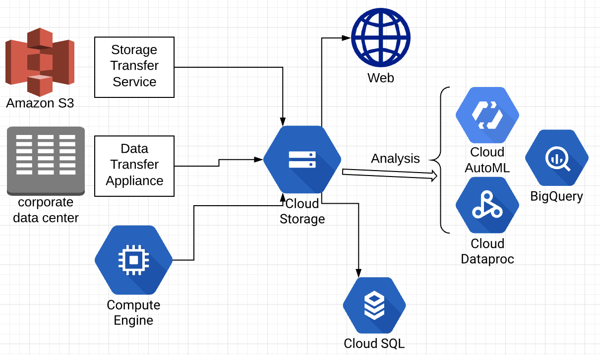

# Data Engineering Overview in Google Cloud Platform

## Big Data Ecosystem
This section is particularly focusing on Apache Pig, Hive, Spark, Hadoop and Beam: 
- Hadoop:
  - Open soure MapReduce framework
  - The underlying technology for **Dataproc**
- HDFS: Hadoop File System
- Pig: 
  - Scripting language that compiles into MapReduce jobs
  - Procedural Data Flow Language: Pig Latin
  - Less developement effort & code efficiency 
  - does not have any notion for partitions
  - supports **Avro**
- Hive
  - Data warehousing system and SQL-like query language
- Spark:
  - fast, interactive, general-purpose framework for SQL, streaming, machine learning, ...
  - solves similar problems as Hadoop MR but with a fast in-memory approach
- Sqoop imports data from a relational DB system or a mainframe into HDFS

## Streaming (or real-time) data
- Generated and transmitted continuously by many data sources
- Thousands of data inputs, sent simultaneously, in small size (KB)
- Commonly used for telemetry - collecting data from a high number of geographically dispersed devices as it's generated
- Examples: 
  - sensors in transportation vehicles - detecting performances and potential issues 
  - Financial institution tracks stock market changes
- Data is processed in small pieces as it comes in 
- Requires low latency
- Typically paired with Pub/Sub for the streaming data ingest and DataFlow for real time processing

 data")

## Batch (or bulk) data
- Large sets of data that "pool" up over time
- Transferring from small number of sources (usually 1)
- Examples: 
  - On-premise database migration to GCP
  - Importing legacy data into Cloud Storage
  - Importing large dataset for machine learning analysis
  - gsutil cp [storage_location] gs://[BUCKET] is an example of batch data import
- Low latency is not as important
- Often stored in storage services such as cloud storage, CloudSQL, BigQuery,...

## Google Cloud Storage as Staging Ground

### Storage "swiss army knife"
- GCS holds all data types in any formats
- Globally available
  - Multi-Regional buckets provide fast access across regions 
  - Regional buckets provide fast access for single regions 
  - Edge caching for increased performance
- Durable and reliable: Versionning and redundancy
- Lower cost than persistent disk
- Control access
  - Project, bucket or object level
  - Useful for ingest, transform and publish workflows
  - Option for Public read access

### Data Engineering perspective
- Migrating existing workfloads 
  - Migrate databases/data into Cloud Storage for import
- Common first step of data lifecyle - get data to GCS
- Staging area for analysis/processing/machine learning import "datalake"

### Getting data in and out of Cloud Storage
- Storage transfer services - S3, GCS, HTTP,... --> GCS
  - one time transfer, periodic sync 
- Data transfer appliance - physically shipped appliance 
  - Load up to 1 petabyte, ship to GCP, loaded into bucket
  - gsutil, JSON API - "gsutil cp ..."

## Database types
- Two primary databases types:
  - relational/SQL
  - non-relational/NoSQL
- Relational (SQL) databases: **"Consistency and reliability over performance"**
  - SQL = Structured Query Language
  - Structured and standardized tables - rows and columns 
  - Data integrity
  - High consistency
  - ACID compliance 
    - Atomicity, Consistency, Isolation and Durability
  - Applications: 
  - Pros: standardized, consistent, reliable and data integrity
  - Cons: Poor scalling, not as fast performing, not good for semi-structured data 
- Non-relational (NoSQL) databases: **"Performance over consistency"**
  - Non-structured (no table)
  - Different standards - key/value, wide table
  - Some have ACID compliance (Datastore)
  - Exemple: Redis, MongoDB, Cassandra, HBase, Bigtable, RavenDB
  - Applications: IoT, user profiles, high speed analytics
  - Pros: Scalable, high performance, not structure-limited
  - Cons: Eventual consistency, data integrity
- Exam expectation: 
  - Understand description between database types 
  - Know which databases version matches with description 
    - Example: "need database with throughput, ACID compliance not necessary, choose three possible options"

## Monitoring Unmanaged Databases

### Logging and Monitoring in unmanaged (GCE) databases 
- Examples: Cassandra, MySQL, MariaDB, MongoDB, Hbase
- Hosted on Compute Engine instances

### Built in vs. additional monitoring
- Built in = no additional configuration needed: No application-level data
- Stackdriver Logging 
  - Audit logs: "Who created this instance?"
  - Does not include application logs
- Stackdriver Monitoring
  - Instance performance metrics: Disk I/O, CPU usage, network connections
  - No application performance metrics 

### What if we want application data?
- Stackdriver Agents! - install and configure in instance
- Logging agent vs Monitoring agent: configure with **fluentd**
- Monitoring agent = Stackdriver Monitoring = application performance/metrics/alerts
  - May require plugin configuration