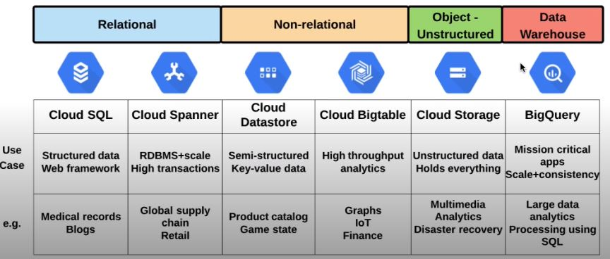
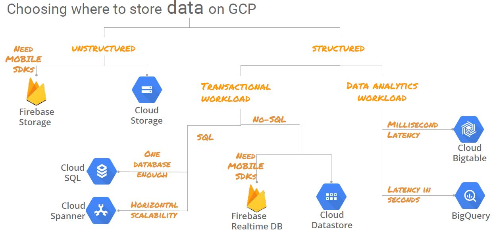
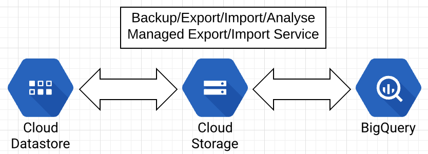
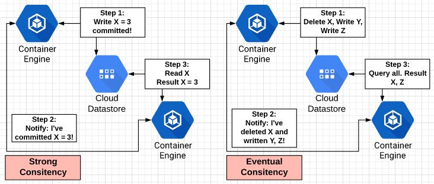
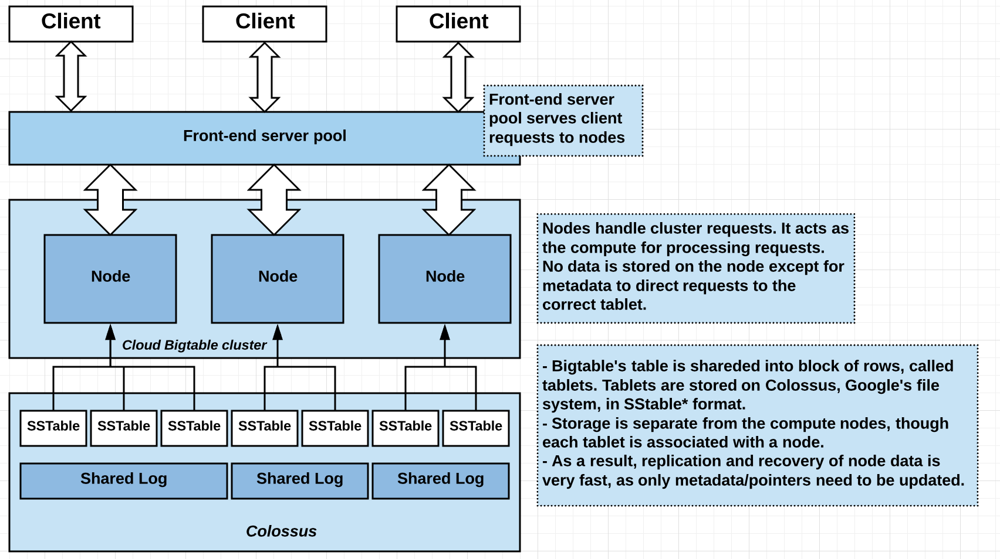
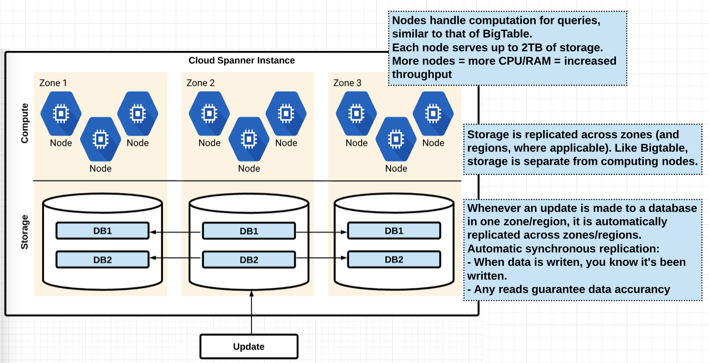

# Choosing a Managed Database

## Big picture perspective: 

- At minimum, know which managed database is the best solution for given use case: 
    - Relational or non-relational?
    - Transactional or analytics?
    - Scalalibity?
    - Lift and shift



- Decision tree criteria



# Cloud SQL Basics

## What is Cloud SQL
- Direct lift and shift of traditional MySQL/PostgreSQL workloads, with the maintenance stack managed for you. 

## What is managed
- OS installation/management 
- Database installation/management
- Backups
- Scalling - disk space
- Availability
    - Failover
    - Read replicas
- Monitoring
- Authorize network connections/proxy/use SSL

## Limitations
- Read replicas limited to same region as master: limited global availability
- Max disk size of 10TB
- If need > 10TB or global availability in RDBMS, use **Spanner**

## Importing data

### Importing data into Cloud SQL
- Cloud Storage as staging ground
- SQL dump/CSV file format

### Export/Import process
- Export SQL dump/CSV file: SQL dump  file cannot contain triggers, views, stored procedures
- Get dump/CSV file into Cloud Storage
- Import from Cloud Storage into Cloud SQL instance

### Best Practices
- Use correct flags for dump file (--flag_name)
    - databases, hex-blob, skip-triggers, set-gtid-purged=OFF, ignore-table
    - Compress data to reduce costs: Cloud SQL can import compressed .gz files
    - Use InnoDB for Second Generation instances
- General SQL effeciency best practices 
    - More, smaller tables better than fewer, large tables: Normalization of tables
    - Define your SELECT fields instead of using SELECT *
    - When joining tables, use INNER JOIN instead of WHERE: WHERE creates more variable combinations = more work

# Cloud Datastore 
## Cloud Datastore overview
- No Ops
    - No provisionning of instances, compute, storage, etc
    - Compute layer is abstracted away
- Highly scalable 
    - Multi-region access available 
    - Sharding/replication handled automatically
- NoSQL/non-relational database
    - Flexible structure/relationship between objects

## Use Datastore for...
- Applications that need highly available structured data, at scale
- Product catalogs, real-time inventory
- User profiles - mobile apps
- Game save states
- ACID transactions - e.g. transferring funds between accounts

## Do not use Datastore for...
- Analytics (full SQL semantics) => Use BigQuery/Cloud Spanner
- Extreme scale (10M+ read/writes per second) => Use Bigtable
- Don't ned ACID transactions/data not highly structured => Bigtable
- Lift and shift (existing MySQL) => Use Cloud SQL
- Near zero latency (sub-10ms) => Use in-memory database (Redis)

## Other important facts
- Single Datastore per project
- Multi-regional for wide access, single region for lower latency for single location
- Datastore is a transactional database 
- Bigtable is an analytic database
- IAM roles:
  - Primitive and predefined 
  - Owner, user, viewer, import/export admin, index admin



## Data organization
- Entities are grouped by kind (category) and can be hierarchical (nested)
- Each entity has one or more properties
- Properties have a value assigned

| Concept                       | Relational Database | Datastore |
| :---------------------------- | :------------------ | :-------- |
| Category of object            | Table               | Kind      |
| Single Object                 | Row                 | Entity    |
| Individual data for an object | Column              | Property  |
| Unique ID for an object       | Primary key         | Key       |

## Queries and Indexing

### Query

- Retrieve entity from Datastore that meets a set of conditions
- Query includes
  - Entity kind
  - Filters 
  - Sort order
- Query methods
  - Programmatics
  - Web console
  - Google Query Language (GQL)

### Indexing
- Queries gets results from indexes 
  - Contain entity keys specified by index properties 
  - Updated to reflect changes
  - Correct query results available with no additional computation needed
- Index types
  - Built-in - default option: allows single property queries
  - Composite - specified with index configuration file (index.yaml)
  ```shell
  gcloud datastore create-indexes index.yaml
  ```
  - Example index.yaml
  ```shell
  indexes:
  - kind: Task
    properties: 
    - name: tags
    - name: created
  - kind: Associated
    properties: 
    - name: collaborators
    - name: created
  ```
- Danger - Exploding Indexes!
  - Default - create entry for every possible combination of property values
  - Results in higher storage and degraded performance 
  - Solutions: 
    - Use custom index.yaml file to narrow index scope
    - Do not index properties that don't need indexing

## Data Consistency

### What is data consistency in queries?
- Strongly consitent = Parallel processes see changes in same order
  - Query is guaranteed up to date, but may take longer to complete
- Eventually consistent = Parallel process can see change out of order, will eventually see accurate end state
  - Faster query, but may sometimes return stale results
- Performance vs. accurary
- Ancestor query/key-value operation 
- Global queries/projections = eventual

### Use cases 
- Strong - financial transaction
  - Make deposit -- check balance
- Eventual - census population
  - Order not as important, as long a you get eventual result



Read more: 
- [Balancing Strong and Eventual Consistency with Cloud Datastore](https://cloud.google.com/datastore/docs/articles/balancing-strong-and-eventual-consistency-with-google-cloud-datastore/)
- [Eventual vs Strong Consistency in Distributed Databases](https://hackernoon.com/eventual-vs-strong-consistency-in-distributed-databases-282fdad37cf7)

# Cloud BigTable

## Bigtable Overview
### What is Cloud Bigtable? 
- High performance, massively scalable NoSQL database
- Ideal for large analytic workloads

### History of Bigtable
- Considered one of the originators of NoSQL industry
- Developed by Google in 2004
  - Existing database solutions were too slow 
  - Needed realtime access to petabytes of data
- Powers Gmail, Youtube, Google Maps and others

### What is it used for?
- High throughput analytics 
- Huge datasets 

### Use cases
- Financial data - stock prices 
- IoT data
- Marketing data - purchase histories
  
### Access Control
- Project wide or instance level 
- Read/Write/Manage



## Instance Configuration

### Instance basics 
- Not no-ops 
  - Must configure nodes
- Entire Bigtable project call "instance"
  - Al nodes and clusters 
- Nodes grouped into clusters
  - 1 or more clusters per instance 
- Auto-scaling storage: In some cases, it can be useful to scale your Cloud Bigtable cluster programmatically based on metrics such as the cluster's CPU usage. For example, if your cluster is under heavy load, and its CPU usage is extremely high, you can add nodes to the cluster until its CPU usage drops

>Source: https://cloud.google.com/bigtable/docs/scaling 

- Instance types:
  - Development - low cost, single node
    - No replication
  - Production - 3+ per cluster 
    - Replication available, throughput guarantee

### Replication and Changes
- Synchronize data between clusters 
  - One additional cluster, total 
  - (Beta) available cross-region
- Resizing
  - Add and remove nodes and clusters with no downtime
- Changing disk type (e.g. HDD to SSD) requires new instance

### Interacting with Bigtable 
- Command line - cbt tool or HBase shell: cbt tool is simpler and preferred option

1. Install the cbt command Google SDK: 
   - **gcloud components update**
   - **gcloud components install cbt**
2. Configure cbt to use your project and instance via .cbtrc file: 
   - **echo -e "project = [PROJECT_ID]\ninstance = [INSTANCE_ID]" > ~/.cbtrc**
3. Create table
   - **cbt createtable my-table**
4. List the table 
   - **cbt ls**
5. Add a column family
   - **cbt createfamily my-table cf1**
6. List column family
   - **cbt ls my-table**
7. Add value to row1, using column family cf1 and column qualifier c1
   - **cbt set my-table r1 cf1:c1=test-value**
8. Use the cbt read command to read the data you added to the table
   - **cbt read my-table**
9. Delete the table (if not deleting instance):
   - **cbt deletetable my-table**

## Instance Organization
- Data organization
  - One big table
  - Table can be thousands of columns/billions of rows 
  - Table is shared acorss tablets
- Table components 
  - Row key: First column
  - Columns grouped into columns families 

<table class="tg">
  <tr>
    <th class="tg-0pky"></th>
    <th class="tg-c3ow" colspan="2">Column-Family-1</th>
    <th class="tg-c3ow" colspan="2">Column-Family-2</th>
  </tr>
  <tr>
    <td class="tg-0pky">Row key</td>
    <td class="tg-0pky">Column-Qualifier-1</td>
    <td class="tg-0pky">Column-Qualifier-2</td>
    <td class="tg-0pky">Column-Qualifier-1</td>
    <td class="tg-0pky">Column-Qualifier-2</td>
  </tr>
  <tr>
    <td class="tg-0pky">r1</td>
    <td class="tg-0pky">r1, cf1:cq1:[value]</td>
    <td class="tg-0pky">r1, cf1:cq1:[value]</td>
    <td class="tg-0pky">r1, cf2:cq1:[value]</td>
    <td class="tg-0pky">r1, cf2:cq2:[value]</td>
  </tr>
  <tr>
    <td class="tg-0pky">r2</td>
    <td class="tg-0pky">r2, cf1:cq1:[value]</td>
    <td class="tg-0pky">r2, cf1:cq2:[value]</td>
    <td class="tg-0pky">r2, cf2:cq1:[value]</td>
    <td class="tg-0pky">r2, cf2:cq2:[value]</td>
  </tr>
</table>

- Indexing and Queries 
  - Only the row key is indexed
  - Schema design is necessary for efficient queries!
  - Field promotion - move fields from column data to row key

## Schem Design 

### Schema Design
- **Each table has only one index, the row key**.
- **Rows are sorted lexicographically by row key**, from the lowest to the highest byte string. Row keys are sorted in big-endian, or network, byte order, the binary equivalent of alphabetical order.
- **Columns are grouped by column family** and sorted in lexicographic order within the column family.
- **All operations are atomic at the row level**. For example, if you update two rows in a table, it's possible that one row will be updated successfully and the other update will fail. For this reason, follow these guidelines:
  - Avoid schema designs that require atomicity across rows.
  - In general, keep all information for an entity in a single row. However, if your use case doesn't require you to make atomic updates or reads to an entity, you can split the entity across multiple rows. Splitting across multiple rows is recommended if the entity data is large (hundreds of MB).
- Ideally, **both reads and writes should be distributed** evenly across the row space of the table.
- **Related entities should be stored in adjacent rows**, which makes reads more efficient.
- **Cloud Bigtable tables are sparse**. Empty columns don't take up any space. As a result, it often makes sense to create a very large number of columns, even if most columns are empty in most rows.
- As a best practice, store a maximum of 10 MB in a single cell and 100 MB in a single row

### Choosing a row key
Start by asking how you'll use the data that you plan to store. For example:

- User information: Do you need quick access to information about connections between users (for example, whether user A follows user B)?
- User-generated content
- Time series data

#### Types of key
- Reverse domain names
- String identifiers
- Timestamps

#### Multiple values in a single row key
- Row key prefixes
- Using row key prefixes for multitenancy

#### Row keys to avoid
- Domain names
- Sequential numeric IDs
- Frequently updated identifiers
- Hashed values

<table class="tg">
  <tr>
    <th class="tg-c3ow">Row Key</th>
  </tr>
  <tr>
    <td class="tg-0pky">memusage-user-timestamp</td>
  </tr>
  <tr>
    <td class="tg-0pky">20-mattu-201805082048</td>
  </tr>
</table>

### Table design - Time series data
- For time series data, use **tall and narrow** table (one event per row)
  - Easier to run queries against data

# Cloud Spanner

## Cloud Spanner Overview
- What is Cloud Spanner?
  - Fully managed, highly scalable/available, relational database
  - Similar architecture to Bigtable
  - "NewSQL"

- What is it used for
  - Mission critical, relational databases that need strong transactional consistency (ACID compliance)
  - Wide scale availability 
  - Higher workloads than Cloud SQL can support
  - Standard SQL format (ANSI 2011)

- Horizontal vs. vertical scaling
  - Vertical = more compute on single instance (CPU/RAM)
  - Horizontal = more instances (nodes) sharing the load

- Compared to Cloud SQL 
  - Cloud SQL = Cloud incarnation of on-premise MySQL database
  - Spanner = designed form the ground up for the cloud
  - Spanner is not a "drop-in" replacement for MySQL
    - Not MySQL/PostgreSQL compatible
    - Work required to migrate
    - However, when making transition, don't need to choose between consistency and scalability

- Transactional Consistency vs. Scalability

<table class="tg">
  <tr>
    <th class="tg-7btt">Database </th>
    <th class="tg-7btt">Cloud Spanner</th>
    <th class="tg-7btt">Transactional Relational</th>
    <th class="tg-7btt">Transactional Non-relational</th>
  </tr>
  <tr>
    <td class="tg-0pky">Schema</td>
    <td class="tg-0pky">Yes</td>
    <td class="tg-0pky">Yes</td>
    <td class="tg-0pky">No</td>
  </tr>
  <tr>
    <td class="tg-0pky">SQL</td>
    <td class="tg-0pky">Yes</td>
    <td class="tg-0pky">Yes</td>
    <td class="tg-0pky">No</td>
  </tr>
  <tr>
    <td class="tg-0pky">Consistency</td>
    <td class="tg-0pky">Strong</td>
    <td class="tg-0pky">Strong</td>
    <td class="tg-0pky">Eventual</td>
  </tr>
  <tr>
    <td class="tg-0pky">Availability</td>
    <td class="tg-0pky">High</td>
    <td class="tg-0pky">Failover</td>
    <td class="tg-0pky">High</td>
  </tr>
  <tr>
    <td class="tg-0pky">Scalability</td>
    <td class="tg-0pky">Horizontal</td>
    <td class="tg-0pky">Vertical</td>
    <td class="tg-0pky">Horizontal</td>
  </tr>
  <tr>
    <td class="tg-0pky">Replication</td>
    <td class="tg-0pky">Automatic</td>
    <td class="tg-0pky">Configurable</td>
    <td class="tg-0pky">Configurable</td>
  </tr>
</table>



### Identity and Access Management (IAM)
- Project, Instance or Database level
- roles/spanner.____
- Admin - Full access to all Spanner resources
- Database admin - Create/edit/delete databases, grant access to databases
- Database Reader - read/execute database/schema
- Viewer - view instances and databases 
  - Cannot modifiy or read from database. 

## Data Organization and Schema
### Schema
- RDBMS = tables
- Supports SQL joins, queries, etc
- Same SQL dialect as BigQuery
- Tables are handled differently: 
  - Parent/child tables
  - Interleave Data Layout

#### Typical Relational Database
Two sets of related data = Two tables 

<table class="tg">
  <tr>
    <th class="tg-6dj5">SingerID</th>
    <th class="tg-6dj5">SingerName</th>
    <th class="tg-0lax"></th>
    <th class="tg-zci2">SingerID</th>
    <th class="tg-zci2">AlbumID</th>
    <th class="tg-zci2">AlbumName</th>
  </tr>
  <tr>
    <td class="tg-oy90">1</td>
    <td class="tg-oy90">Beatles</td>
    <td class="tg-0lax"></td>
    <td class="tg-w747">1</td>
    <td class="tg-w747">1</td>
    <td class="tg-w747">Help!</td>
  </tr>
  <tr>
    <td class="tg-oy90">2</td>
    <td class="tg-oy90">U2</td>
    <td class="tg-0lax"></td>
    <td class="tg-w747">1</td>
    <td class="tg-w747">2</td>
    <td class="tg-w747">Abbey Road</td>
  </tr>
  <tr>
    <td class="tg-oy90">3</td>
    <td class="tg-oy90">Pink Floyd</td>
    <td class="tg-0lax"></td>
    <td class="tg-w747">3</td>
    <td class="tg-w747">1</td>
    <td class="tg-w747">The Wall</td>
  </tr>
</table>

#### Spanner
Two sets of related data = Interleave tables

<table class="tg">
  <tr>
    <th class="tg-2qwx">Singers(1)</th>
    <th class="tg-2qwx">"Marc"</th>
    <th class="tg-hrrh">"Richards"</th>
    <th class="tg-hrrh">&lt;Bytes&gt;</th>
    <th class="tg-hrrh"></th>
    <th class="tg-hrrh"></th>
  </tr>
  <tr>
    <td class="tg-hrrh">Albums(1, 1)</td>
    <td class="tg-hrrh"></td>
    <td class="tg-hrrh"></td>
    <td class="tg-hrrh"></td>
    <td class="tg-hrrh">"Total Junk"</td>
    <td class="tg-hrrh"></td>
  </tr>
  <tr>
    <td class="tg-hrrh">Albums(1, 2)</td>
    <td class="tg-hrrh"></td>
    <td class="tg-hrrh"></td>
    <td class="tg-hrrh"></td>
    <td class="tg-hrrh">"Go, Go, Go"</td>
    <td class="tg-hrrh"></td>
  </tr>
  <tr>
    <td class="tg-hrrh">Songs(1, 2, 1)</td>
    <td class="tg-hrrh"></td>
    <td class="tg-hrrh"></td>
    <td class="tg-hrrh"></td>
    <td class="tg-hrrh"></td>
    <td class="tg-hrrh">"42"</td>
  </tr>
  <tr>
    <td class="tg-hrrh">Songs(1, 2, 1)</td>
    <td class="tg-hrrh"></td>
    <td class="tg-hrrh"></td>
    <td class="tg-hrrh"></td>
    <td class="tg-hrrh"></td>
    <td class="tg-hrrh">"Nothing is the same"</td>
  </tr>
  <tr>
    <td class="tg-hrrh">Singers(2)</td>
    <td class="tg-hrrh">"Catalina"</td>
    <td class="tg-hrrh">"Smith"</td>
    <td class="tg-hrrh">&lt;Bytes&gt;</td>
    <td class="tg-hrrh"></td>
    <td class="tg-hrrh"></td>
  </tr>
  <tr>
    <td class="tg-hrrh">Albums(2, 1)</td>
    <td class="tg-hrrh"></td>
    <td class="tg-hrrh"></td>
    <td class="tg-hrrh"></td>
    <td class="tg-hrrh">"Green"</td>
    <td class="tg-hrrh"></td>
  </tr>
  <tr>
    <td class="tg-hrrh">Songs(2, 1, 1)</td>
    <td class="tg-hrrh"></td>
    <td class="tg-hrrh"></td>
    <td class="tg-hrrh"></td>
    <td class="tg-hrrh"></td>
    <td class="tg-hrrh">"Let's Get Back Together"</td>
  </tr>
  <tr>
    <td class="tg-hrrh">Songs(2, 1, 2)</td>
    <td class="tg-hrrh"></td>
    <td class="tg-hrrh"></td>
    <td class="tg-hrrh"></td>
    <td class="tg-hrrh"></td>
    <td class="tg-hrrh">"Starting Again"</td>
  </tr>
  <tr>
    <td class="tg-hrrh">Songs(2, 1, 3)</td>
    <td class="tg-hrrh"></td>
    <td class="tg-hrrh"></td>
    <td class="tg-hrrh"></td>
    <td class="tg-hrrh"></td>
    <td class="tg-hrrh">"I Knew You Were Magic"</td>
  </tr>
  <tr>
    <td class="tg-hrrh">Albums(2, 2)</td>
    <td class="tg-hrrh"></td>
    <td class="tg-hrrh"></td>
    <td class="tg-hrrh"></td>
    <td class="tg-hrrh">"Forever Hold Your Peace"</td>
    <td class="tg-hrrh"></td>
  </tr>
  <tr>
    <td class="tg-hrrh">Songs(2, 2, 1)</td>
    <td class="tg-hrrh"></td>
    <td class="tg-hrrh"></td>
    <td class="tg-hrrh"></td>
    <td class="tg-hrrh"></td>
    <td class="tg-hrrh">null</td>
  </tr>
  <tr>
    <td class="tg-7euo">Songs(2, 2, 2)</td>
    <td class="tg-7euo"></td>
    <td class="tg-7euo"></td>
    <td class="tg-7euo"></td>
    <td class="tg-7euo"></td>
    <td class="tg-7euo">"Hello"</td>
  </tr>
</table>

### Primary keys and Schema
- How to tell which child tables to store with which parent tables 
- Usually a natural fit
  - 'Customer ID'
  - 'Invoice ID'
- Avoid hotspotting
  - No sequential numbers
  - No timestamps (also sequential)
    - Use descending order if timestamps required