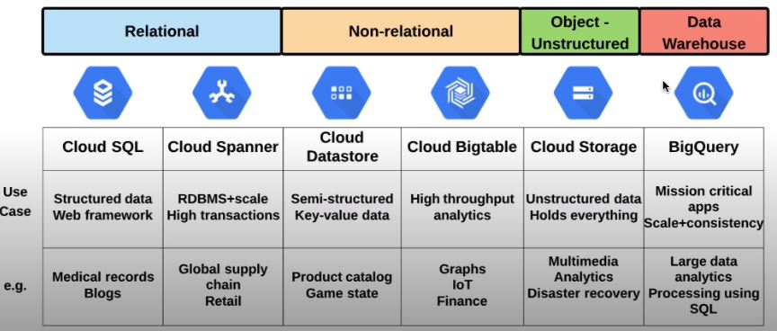
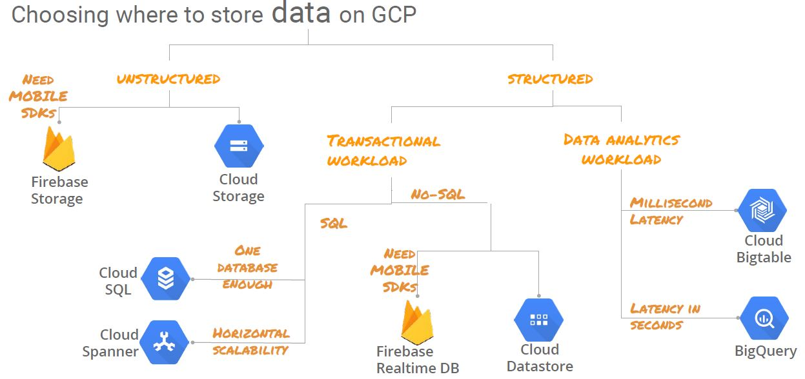
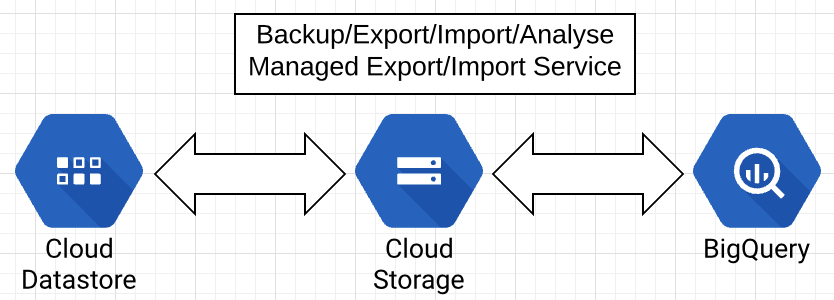
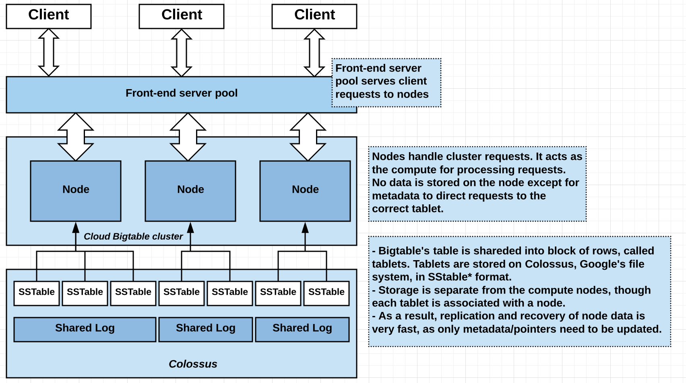

# Choosing a Managed Database

## Big picture perspective: 

- At minimum, know which managed database is the best solution for given use case: 
    - Relational or non-relational?
    - Transactional or analytics?
    - Scalalibity?
    - Lift and shift



- Decision tree criteria
    - Structured (database) or unstructured 
    - Analytical or transactional?
    - Relational (SQL) or Non-relational
    - Scalability/availability/size requirements? 



## Cloud SQL Basics

### What is Cloud SQL
- Direct lift and shift of traditional MySQL/PostgreSQL workloads, with the maintenance stack managed for you. 

### What is managed
- OS installation/management 
- Database installation/management
- Backups
- Scallin - disk space
- Availability
    - Failover
    - Read replicas
- Monitoring
- Authorize network connections/proxy/use SSL

### Limitations
- Read replicas limited to same region as master: limited global availability
- Max disk size of 10TB
- If need > 10TB or global availability in RDBMS, use Spanner

## Importing data

### Importing data into Cloud SQL
- Cloud Storage as staging ground
- SQL dump/CSV file format

### Export/Import process
- Export SQL dump/CSV file: SQL dump  file cannot contain triggers, views, stored procedures
- Get dump/CSV file into Cloud Storage
- Import from Cloud Storage into Cloud SQL instance

### Best Practices
- Use correct flags for dump file (--flag_name)
    - databases, hex-blob, skip-triggers, set-gtid-purged=OFF, ignore-table
    - Compress data to reduce costs: Cloud SQL can import compressed .gz files
    - Use InnoDB for Second Generation instances
- General SQL effeciency best practices 
    - More, smaller tables better than fewer, large tables: Normalization of tables
    - Define your SELECT fields instead of using SELECT *
    - When joining tables, use INNER JOIN instead of WHERE: WHERE creates more variable combinations = more work

# Cloud Datastore 
## Cloud Datastore overview
- No Ops
    - No provisionning of instances, compute, storage, etc
    - Compute layer is abstracted away
- Highly scalable 
    - Multi-region access available 
    - Sharding/replication handled automatically
- NoSQL/non-relational database
    - Flexible structure/relationship between objects

### Use Datastore for...
- Applications that need highly available structured data, at scale
- Product catalogs, real-time inventory
- User profiles - mobile apps
- Game save states
- ACID transactions - e.g. transferring funds between accounts

### Do not use Datastore for...
- Analytics (full SQL semantics) => Use BigQuery/Cloud Spanner
- Extreme scale (10M+ read/writes per second) => Use Bigtable
- Don't ned ACID transactions/data not highly structured => Bigtable
- Lift and shift (existing MySQL) => Use Cloud SQL
- Near zero latency (sub-10ms) => Use in-memory database (Redis)

### Other important facts
- Single Datastore per project
- Multi-regional for wide access, single region for lower latency for single location
- Datastore is a transactional database 
- Bigtable is an analytic database
- IAM roles:
  - Primitive and predefined 
  - Owner, user, viewer, import/export admin, index admin



## Data organization
- Entities grouped by kind (category)
- Entities can be hierarchical (nested)
- Each entity has one or more properties
- Properties have a value assigned

| Concept                       | Relational Database | Datastore |
| :---------------------------- | :------------------ | :-------- |
| Category of object            | Table               | Kind      |
| Single Object                 | Row                 | Entity    |
| Individual data for an object | Column              | Property  |
| Unique ID for an object       | Primary key         | Key       |

## Queries and Indexing

### Query

- Retrieve entity from Datastore that meets a set of conditions
- Query includes
  - Entity kind
  - Filters 
  - Sort order
- Query methods
  - Programmatics
  - Web console
  - Google Query Language (GQL)

### Indexing
- Queries gets results from indexes 
  - Contain entity keys specified by index properties 
  - Updated to reflect changes
  - Correct query results available with no additional computation needed
- Index types
  - Built-in - default option: allows single property queries
  - Composite - specified with index configuration file (index.yaml)
  ```shell
  gcloud datastore create-indexes index.yaml
  ```
  - Example index.yaml
  ```shell
  indexes:
  - kind: Task
    properties: 
    - name: tags
    - name: created
  - kind: Associated
    properties: 
    - name: collaborators
    - name: created
  ```
- Danger - Exploding Indexes!
  - Default - create entry for every possible combination of property values
  - Results in higher storage and degraded performance 
  - Solutions: 
    - Use custom index.yaml file to narrow index scope
    - Do not index properties that don't need indexing

## Data Consistency

### What is data consistency in queries?
- "How up to date are these results?"
- "Does the order matter?"
- Strongly consitent = Parallel processes see changes in same order
  - Query is guaranteed up to date, but may take longer to complete
- Eventually consistent = Parallel process can see change out of order, will eventually see accurate end state
  - Faster query, but may sometimes return stale results
- Performance vs. accurary
- Ancestor query/key-value operation 
- Global queries/projections = eventual

### Use cases 
- Strong - financial transaction
  - Make deposit -- check balance
- Eventual - census population
  - Order not as important, as long a you get eventual result

# Cloud BigTable

## Bigtable Overview
### What is Cloud Bigtable? 
- High performance, massively scalable NoSQL database
- Ideal for large analytic workloads

### History of Bigtable
- Considered one of the originators of NoSQL industry
- Developed by Google in 2004
  - Existing database solutions were too slow 
  - Needed realtime access to petabytes of data
- Powers Gmail, Youtube, Google Maps and others

### What is it used for?
- High throughput analytics 
- Huge datasets 

### Use cases
- Financial data - stock prices 
- IoT data
- Marketing data - purchase histories
  
### Access Control
- Project wide or instance level 
- Read/Write/Manage



## Instance Configuration

### Instance basics 
- Not no-ops 
  - Must configure nodes
- Entire Bigtable project call "instance"
  - Al nodes and clusters 
- Nodes grouped into clusters
  - 1 or more clusters per instance 
- Auto-scaling storage 
- Instance types:
  - Development - low cost, single node
    - No replication
  - Production - 3+ per cluster 
    - Replication available, throughput guarantee

### Replication and Changes
- Synchronize data between clusters 
  - One additional cluster, total 
  - (Beta) available cross-region
- Resizing
  - Add and remove nodes and clusters with no downtime
- Changing disk type (e.g. HDD to SSD) requires new instance

### Interacting with Bigtable 
- Command line - cbt tool or HBase shell: cbt tool is simpler and preferred option

1. Install the cbt command Google SDK: 
   - **gcloud components update**
   - **gcloud components install cbt**
2. Configure cbt to use your project and instance via .cbtrc file: 
   - **echo -e "project = [PROJECT_ID]\ninstance = [INSTANCE_ID]" > ~/.cbtrc**
3. Create table
   - **cbt createtable my-table**
4. List the table 
   - **cbt ls**
5. Add a column family
   - **cbt createfamily my-table cf1**
6. List column family
   - **cbt ls my-table**
7. Add value to row1, using column family cf1 and column qualifier c1
   - **cbt set my-table r1 cf1:c1=test-value**
8. Use the cbt read command to read the data you added to the table
   - **cbt read my-table**
9. Delete the table (if not deleting instance):
   - **cbt deletetable my-table**

## Instance Organization
- Data organization
  - One big table (hence then name Bigatat)
  - Table can be thousands of columns/billions of rows 
  - Table is shared acorss tablets
- Table components 
  - Row key: First column
  - Columns grouped into columns families 

<style type="text/css">
.tg  {border-collapse:collapse;border-spacing:0;}
.tg td{font-family:Arial, sans-serif;font-size:14px;padding:10px 5px;border-style:solid;border-width:1px;overflow:hidden;word-break:normal;border-color:black;}
.tg th{font-family:Arial, sans-serif;font-size:14px;font-weight:normal;padding:10px 5px;border-style:solid;border-width:1px;overflow:hidden;word-break:normal;border-color:black;}
.tg .tg-c3ow{border-color:inherit;text-align:center;vertical-align:top}
.tg .tg-0pky{border-color:inherit;text-align:left;vertical-align:top}
</style>
<table class="tg">
  <tr>
    <th class="tg-0pky"></th>
    <th class="tg-c3ow" colspan="2">Column-Family-1</th>
    <th class="tg-c3ow" colspan="2">Column-Family-2</th>
  </tr>
  <tr>
    <td class="tg-0pky">Row key</td>
    <td class="tg-0pky">Column-Qualifier-1</td>
    <td class="tg-0pky">Column-Qualifier-2</td>
    <td class="tg-0pky">Column-Qualifier-1</td>
    <td class="tg-0pky">Column-Qualifier-2</td>
  </tr>
  <tr>
    <td class="tg-0pky">r1</td>
    <td class="tg-0pky">r1, cf1:cq1:[value]</td>
    <td class="tg-0pky">r1, cf1:cq1:[value]</td>
    <td class="tg-0pky">r1, cf2:cq1:[value]</td>
    <td class="tg-0pky">r1, cf2:cq2:[value]</td>
  </tr>
  <tr>
    <td class="tg-0pky">r2</td>
    <td class="tg-0pky">r2, cf1:cq1:[value]</td>
    <td class="tg-0pky">r2, cf1:cq2:[value]</td>
    <td class="tg-0pky">r2, cf2:cq1:[value]</td>
    <td class="tg-0pky">r2, cf2:cq2:[value]</td>
  </tr>
</table>

- Indexing and Queries 
  - Only the row key is indexed
  - Schema design is necessary for efficient queries!
  - Field promotion - move fields from column data to row key

## Schem Design 

### Schema Design
- Per table - Row key is only indexed item
- Keep all entity information in a single row
- Related entities should be in adjacent rows 
  - More efficient reads
- Tables are sparse - empty columns take no space

### Schema efficiency 
- Well defined row keys = less work
  - Multiple values in row key
- Row key (or prefix) should be sufficient for search
- Goal = spread load over multiple nodes
  - All on one node = 'hotspotting'
#### Row key best practices 
- Good row keys = distributed load
  - Reverse domain names (com.linuxacademy.suport)
  - String identifiers (mattu)
  - Time stamps (reverse, NOT at front/or only identifer)
- Poor row keys = hotspotting
  - Domaine names (support.linuxacademy.com)
  - Sequential ID's
  - Timestamps alone/at front

<style type="text/css">
.tg  {border-collapse:collapse;border-spacing:0;}
.tg td{font-family:Arial, sans-serif;font-size:14px;padding:10px 5px;border-style:solid;border-width:1px;overflow:hidden;word-break:normal;border-color:black;}
.tg th{font-family:Arial, sans-serif;font-size:14px;font-weight:normal;padding:10px 5px;border-style:solid;border-width:1px;overflow:hidden;word-break:normal;border-color:black;}
.tg .tg-c3ow{border-color:inherit;text-align:center;vertical-align:top}
.tg .tg-0pky{border-color:inherit;text-align:left;vertical-align:top}
</style>
<table class="tg">
  <tr>
    <th class="tg-c3ow">Row Key</th>
  </tr>
  <tr>
    <td class="tg-0pky">memusage-user-timestamp</td>
  </tr>
  <tr>
    <td class="tg-0pky">20-mattu-201805082048</td>
  </tr>
</table>

### Table design - Time series data
- For time series data, use **tall and narrow** table (one event per row)
  - Easier to run queries against data

