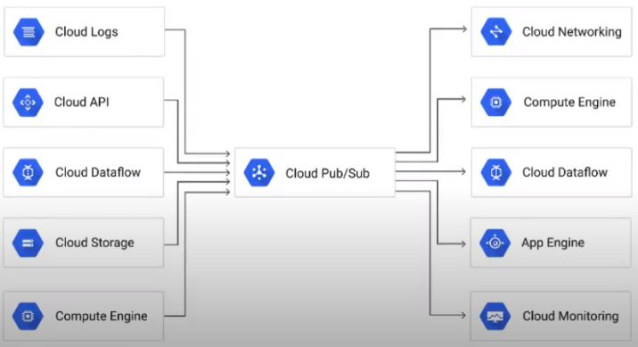

# Architecture: Real Time Messaging with Cloud Pub/Sub

In this part, we will cover the challenges associated with reliably capturing streaming data, tightly vs. loosely coupled systems, and how Cloud Pub/Sub helps to resolve this issue.

## Streaming Data Challenges

- What is streaming data
  - "Unbounded" data
  - Infinitie, never completes, always flowing
  - Ex: Traffic sensors, Credit Card Transactions, Mobile Gaming
- Fast action is often necessary
  - Must quickly collect data, gain insights and take action
  - Sending to storage can add latency
  - Credit card fraud
  - Predict highway traffic
- Tight vs loosely coupled systems
  - Tightly (direct) coupled systems more likely to fail
  - Loosely coupled systems with "buffer" scale with better fault tolerance

  

## Cloud Pub/Sub Overview

We are now going to take a detailed look at what exactly Pub/Sub does, how the process of publishing and subscribing to topics work, and many other points necessary for a thorough understanding. 

### What is Cloud Pub/Sub?
- Global-scale messaging buffer/coupler
- No-ops, global availability, auto-scaling
- Decouples senders and receivers
- Streaming data ingest
  - Also connects other data pipeline services
- Equivalent to Apache Kafka (open source)
- Guaranteed at-least-one delivery
- Asynchronouse messaging - many to many (or any other combination)

 

 