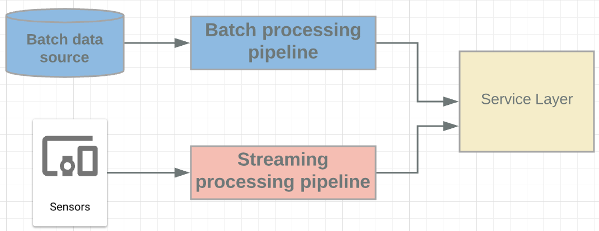

# Architecture: Data Processing Pipelines

## Data Processing Challenges

### What is Data Processing?
  
- Read Data (input)
- Transform it to be relevant - Extract, Transform and Load (ETL)
- Create output

### Challenge: Streaming and Batch data pipelines

- Until recently, separate pipelines required for each
- Difficult to compare recent and historical data
- One pipeline for "fast", another for "accurate"

### Why both? 
- Credit card monitoring
- Compare streaming transactions to historical batch data to detect fraud

### Challenge: Complex element processing
- Element = single data input
- One at a time element ingest from single source = easy
- Combining elements (aggregation) = hard
- Processing data from different sources, streaming, and out of order (composite) = REALLY hard

**GCP Solution: Apache Beam + Cloud Dataflow**

## Cloud Dataflow Overview
### What is it?
- Auto scaling, No-Ops, Stream and Batch Processing 
- Built on Apache Beam
  - Documentation refers to Apache Beam sit
  - Configuration is 100% code-based
- Integrates with other tools (GCP and external)
  - Natively - Pub/Sub, BigQuery, Cloud ML Engine
  - Connectors - BigTable, Apache Kafka
- Pipelines are regional-based


### IAM
- Project-level only - all pipelines in project (or none)
- Pipeline data access separate from pipeline access 
- Dataflow admin - Full pipeline access + machine type/storage bucket config access
- Dataflow Developer - Full pipeline access, no machine type/storage bucket access 
- Dataflow Viewer - view permission only
- Dataflow Worker - Specifically for service accounts
  
### Dataflow vs Dataproc? Beam vs Hadoop/Spark?
- Dataproc
  - Familiar tools/packages
  - Employee skill sets
  - Existing pipelines
- Dataflow 
  - Less overhead
  - Unified batch and stream processing
  - Pipeline portability across Dataflow, Spark, and Flink as runtimes. 


<style type="text/css">
.tg  {border-collapse:collapse;border-spacing:0;}
.tg td{font-family:Arial, sans-serif;font-size:14px;padding:10px 5px;border-style:solid;border-width:1px;overflow:hidden;word-break:normal;border-color:black;}
.tg th{font-family:Arial, sans-serif;font-size:14px;font-weight:normal;padding:10px 5px;border-style:solid;border-width:1px;overflow:hidden;word-break:normal;border-color:black;}
.tg .tg-op08{font-weight:bold;background-color:#ffffff;color:#333333;border-color:inherit;text-align:center;vertical-align:top}
.tg .tg-baqh{text-align:center;vertical-align:top}
.tg .tg-ncgp{background-color:#ffffff;color:#333333;border-color:inherit;text-align:center;vertical-align:top}
</style>
<table class="tg">
  <tr>
    <th class="tg-op08">Workloads</th>
    <th class="tg-op08">Cloud Dataproc</th>
    <th class="tg-op08">Cloud DataFlow</th>
  </tr>
  <tr>
    <td class="tg-ncgp">Streaming processing (ETL)</td>
    <td class="tg-ncgp"></td>
    <td class="tg-ncgp">x</td>
  </tr>
  <tr>
    <td class="tg-ncgp">Batch processing (ETL)</td>
    <td class="tg-ncgp">x</td>
    <td class="tg-ncgp">x</td>
  </tr>
  <tr>
    <td class="tg-baqh">Iteractive processing and notebooks</td>
    <td class="tg-baqh">x</td>
    <td class="tg-baqh"></td>
  </tr>
  <tr>
    <td class="tg-baqh">Machine learning with Spark ML</td>
    <td class="tg-baqh">x</td>
    <td class="tg-baqh"></td>
  </tr>
  <tr>
    <td class="tg-baqh">Preprocessing for machine learning</td>
    <td class="tg-baqh"></td>
    <td class="tg-baqh">x (with Cloud ML Engine)</td>
  </tr>
</table>

## Key Concepts

#### Course/exam perspective
- DataFlow is very code-heavy
- Exam does not go deep into coding question
- Some key concepts/terminology will be tested

### Key terms
- Element - single entry of data (e.g. table row)
- PCollection - Distributed dataset, data input and output
- Transform - Data processing operation (or step) in pipeline 
  - uses programming conditionals (for/while loops, etc)
- ParDo - Type of transformation applied to individual elements 
  - Filter out/extract elements from large group of data


- PCollection and ParDo in example Java code - One step in a multi-step transformation process
```java
Pcollection<LaneInfo> currentConditions = p
    .apply("GetMessages", PubsubIO.readString().fromTopic(topic))
    .apply("ExtractData", ParDo.of(new DoFn<String, LaneInfo>(){
        @ProcessElement
        public void processElement(ProcessContext c) throws Exception {
            String line = c.element();
            c.output(LaneInfo.newLaneInfo(line));
        }
    }));
```

### Dealing with late/out of order data
- Latency is to be expected (network latency, processing time, etc)
- PubSub does not care about late data, that is resolved in Dataflow
- Resolved with Windows + Watermarks + Triggers
- Windows = logically divides element groups by time span
- Watermarks = "timestamp"
  - Event time = when data was generated 
  - Processing time = when data processed anaywhere in the processing pipeline
  - Can use PubSub-provided watermark or source-generated 
- Trigger = determine when results in window are emitted (submitted as completed)
  - Allow late-arriving data in allowed time window to re-aggregate previously submitted results
  - Timestamps, element count, combinations of both

