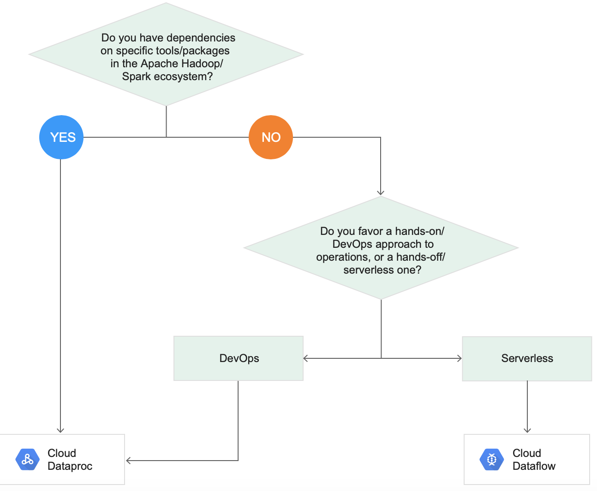
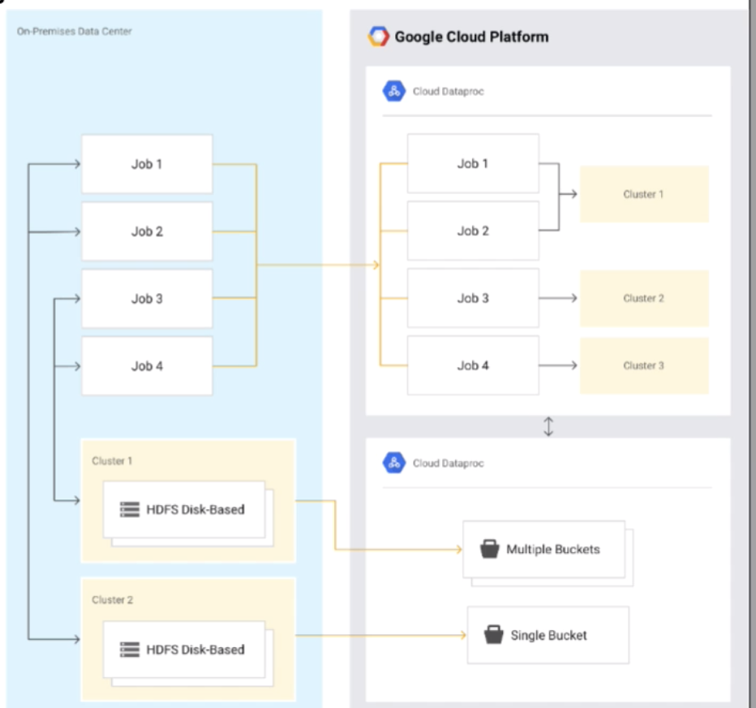
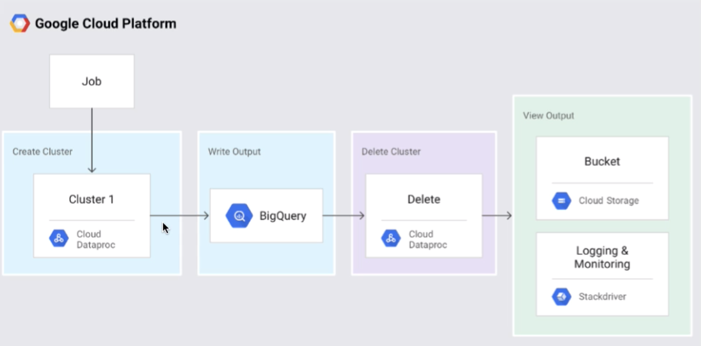

# DataProc overview
## DataProc overview 
### What is Cloud Dataproc?
- Managed version of Hadoop ecosystem
  - Hadoop, Spark, Pig, Hive
  - Lift and Shift to GCP
- Dataproc facts:
  - On-demand, managed Hadoop and Spark clusters
  - Managed, but not no-ops
    - Must configure cluster, not auto-scaling
    - Greatly reduces administrative overhead
  - Integrates with other GCP services
    - Separate data from cluster - save costs
  - Familiar Hadoop/Spark ecosystem environment
    - Easy to move existing projects
  - Base on Apache Bigtop distribution
    - Hadoop, Spark, Hive, Pig
  - HDFS available (but maybe not optimal)
  - Other ecosystem tools can be installed as well via initialization actions
### What is MapReduce?
Simple definition: Take big data, distribute it to many workers (map), combine results of many pieces (reduce)
- Distributed/parallel computing

###  Pricing
- Standard Compute Engine machine type pricing + managed Dataproc premiumn
- Premiumn = $0.01 per vCPU core/hour. More about pricing https://cloud.google.com/dataproc/pricing 

### IAM - Identity and Access Management
- Project level only (primitive and predefined roles)
- Cloud Dataproc Editor, Viewer, Worker
- **Editor** - Full access to create/delete/edit clusters/job/workflows
- **Viewer** - View access only
- **Worker** - Assigned to service accounts: Read/write GCS, write to Cloud Logging



# Configure Dataproc Cluster and Submit Job
## Create cluster
- gcloud dataproc cluster create [cluster_name] --zone [zone_name]
- Configure master node, worker nodes
  - Master contains YARN resource manager
- Example of creating a Dataproc Cluster via command line: 
```shell
gcloud dataproc clusters create cluster-1 \
--subnet default \
--zone us-central1-b \
--master-machine-type n1-standard-1 \
--master-boot-disk-size 500 \
--num-workers 2 \
--workers-machine-type n1-standard-1 \
--worker-boot-disk-size 500 \
--project pw-data-engineer \
--initialization-actions 'gs://dataproc-initialization-actions/kafka/kafka.sh'
```
- Google-provided Dataproc initialization scripts: https://console.cloud.google.com/storage/browser/dataproc-initialization-actions/ 
- Reference for example job submission: https://cloud.google.com/dataproc/docs/quickstarts/quickstart-console

## Updating clusters 
- Can only change # workers/pre-emptible VM's/labels/toggle gracfull decommission
- Automatically reshards data for you

### Pre-emptible VM"s on Dataproc
- Excellent low cost worker nodes 
- Dataproc manages entire leavejoin process
  - No need to configure startup/shutdown scripts 
  - Just add PVM's... and that's it
- No assigned disks for HDFS (only disk for caching)
- Want a mix of standard + PVM worker nodes
  
## Access your cluster
- SSH into master - same as any computeur engine instance
- gcloud compute ssh [master-node-name]
### Access via web - 2 options
- Open firewall ports to your network (8088, 9870)
- Use SOCKS proxy - does not expose firewall ports
#### SOCKS proxy configuration
- SSH to master to enable port forwarding
  ```shell
  gcloud compute ssh [master-host-name] --project=[project-id] --zone=[master-host-zone] -- -D 1080 -N
  ```
- Open new terminal window and launch the web browser with parameters (varies by OS/browser):
  ```shell
  "/Applications/Google Chrome.app/Contents/MacOS/Google Chrome" --proxy-server="socks5://localhost:1080" --host-resolver-rules="MAP * 0.0.0.0 , EXCLUDE localhost" --user-data-dir=/tmp/cluster1-m
  ```
  - Browse to http://[master]:port
    - 8088 - Hadoop
    - 9870 - HDFS
- Using Cloud Shell (must use for each port)
  ```shell
  gcloud compute ssh master-host-name --project=project-id --zone master-host-zone -- -4 -N -L port1:master-host-name:port2
  ```
  - Use Web Preview to choose port (8088/9870).

## Migrating and Optimizing for Google Cloud

### What are we moving/optimizing?
- Data (from HDFS)
- Jobs (pointing to Google Cloud locations)
- Treating clusters as ephemeral (temporary) rather than permanent entities
  
  
### Migration best practices
- Move data first (generally Cloud Storage buckets)
  - Possible exceptions
    - Apache HBase data to Bigtable
    - Apache Impala to BigQuery
    - Can still choose to move to GCS if Bigtable/BQ features not needed
- Small scale experimentation (proof of concept)
  - Use a subset of data to test
- Think in terms of ephemeral clusters
- Use GCP tools to optimize and save costs

### Optimize for the cloud ("Lift and Leverage")
- Separate storage and compute (cluster)
  - save on costs: no need to keep cluster to keep/access data
  - Simplify workloads 
    - No shaping workloads to fit hardware
    - Simplify storage capacity 
  - HDFS -> Google Cloud Storage
  - Hive -> BigQuery
  - HBase -> Bigtable


### Converting from HDFS to Google Cloud Storage
1. Copy data to GCS
   - Install connector or copy manually
2. Update file prefix in scripts
   - From hdfs:// to gs://
3. Use Dataproc, and run against/output to GCS

## Best practices for Cluster Performance
### Dataproc performance optimization (GCP-specific)
- Keep your data close to your cluster
  - Place dataproc cluster in the same region as storage bucket
- Larger persistent disk = better performance
  - Also, consider using SSD over HDD, though at sightly higher cost
- Allocate more VM's
  - Use preemptible VM's to save on costs
  - More VM's will cost more than larger disks if more disk throughput is needed