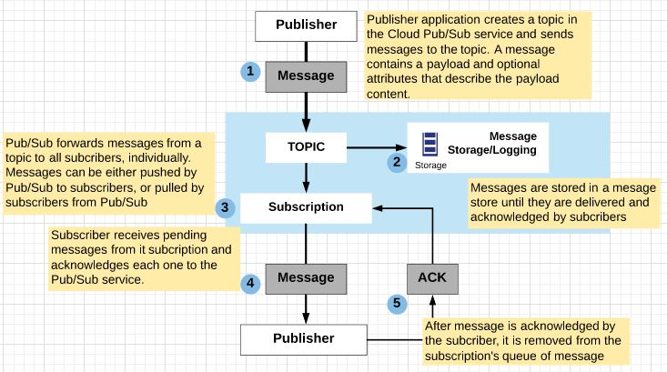
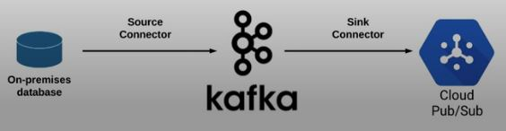

# Real Time Messaging

In this part, we will cover the challenges associated with reliably capturing streaming data, tightly vs. loosely coupled systems, and how Cloud Pub/Sub helps to resolve this issue.

## Streaming Data Challenges

- Streaming is basically data processing on unbounded data; 
- Well streaming processing design: low latency, speculative or partial results, ability to flexibly reason about time, controls for correctness, and the power to peform complex analysis; 
- Streaming processing makes data processing possible to derive real-time insights from growing data: 
  - Scale to variable volumnes
  - Act on real-time data using continuous queries
  - Derive insights from data in flight

### Challenge #1: Variable volumes requires ability of ingest to scale and be fault-tolerant
- Tight vs loosely coupled systems
  - Tightly (direct) coupled systems more likely to fail
  - Loosely coupled systems with "buffer" scale with better fault tolerance

  

### Challenge #2: Latency is to be expected
- Streaming data can be late and unordered due to a variety of reasons: 
  - Transmit: Network delay or unavailable, Ingest delay (write latency), Ingest failure
  - Ingest: Throughput (read latency), Backlog, Hardware failure
  - Process: Starved resources, Internal backlog
- The Dataflow/Beam model maps onto the four questions that are relevant in any out-of-order data processing pipeline: 
  - **What results are calculated?** Answered via transformations. 
  - **Where in event time are results calculated?** Answered via event-time windowing. 
  - **When in processing time are results materialized?** Answered via watermarks, triggers, and allowed lateness
  - **How do refinements of results relate?** Answered via accumulation modes

### Challenge #3: Need instant insights
- Continuous query processing, Visualization, Analytics, etc
- BigQuery lets you ingest streaming data and run queries as the data arrives
- A system that can deal with reference/historical data and live streaming data if you want real time insight. To realize this task, both historical and live data need to be integrated within the same application at time of analyzing;  

### Streaming data processing on GCP: A common configuration
 


## Cloud Pub/Sub Overview

We are now going to take a detailed look at what exactly Pub/Sub does, how the process of publishing and subscribing to topics work, and many other points necessary for a thorough understanding. 

### What is Cloud Pub/Sub?
- Global-scale messaging buffer/coupler
  - Number of publishers
  - Number of subscribers
  - Size of messages 
  - Number of messages
  - Throughput of messages
- No-ops, global availability, auto-scaling
- Decouples senders and receivers
- Streaming data ingest
  - Also connects other data pipeline services
- Equivalent to Apache Kafka (open source)
- Guaranteed at-least-one delivery
- Asynchronouse messaging - many to many (or any other combination)
- Durability: Messages are saved to be delivered later, when subscribers are not around to receive them. 

 

### How it works - terminology?

  

##  Pub/Sub Hands On
1. Create a topic called my-topic
```shell
gcloud pubsub topics create my-topic
```
2. Create a subscription to topic my-topic
```shell
gcloud pubsub subscriptions create --topic my-topic mySub1
```
3. Publish a message to topic my-topic
```shell
gcloud pubsub topics publish my-topic --message "Hello"
```
4. Retrieve message with your subscription, acknowledge receipt and remove message from the queue
```shell
gcloud pubsub subscriptions pull --auto-ack mySub1
```
5. Cancel subscription
```shell
gcloud pubsub subscriptions delete mySub1
```

### Push and Pull
- Pub/Sub can either **push** messages to subcribers, or subscribers can **pull** messages from Pub/Sub;
- Push = lower latency, more real-time
- Push subcribers must be Webhook endpoints that accept POST over HTTPS
- Pull ideal for large volumne of messages - batch delivery

### IAM
- Control access at project, topic, or subscription level
- Admin, Editor, Publisher, Subscriber
- Service accounts are best practice

### Pricing
- Data volumne used per month (per GB)

<table class="tg">
  <tr>
    <th class="tg-amwm">Monthly data</th>
    <th class="tg-amwm">Price Per GB</th>
  </tr>
  <tr>
    <td class="tg-0lax">First 10 GB</td>
    <td class="tg-0lax">$0.00</td>
  </tr>
  <tr>
    <td class="tg-0lax">Next 50 TB</td>
    <td class="tg-0lax">$0.06</td>
  </tr>
  <tr>
    <td class="tg-0lax">Next 100 TB</td>
    <td class="tg-0lax">$0.05</td>
  </tr>
  <tr>
    <td class="tg-0lax">Beyond 150 TB</td>
    <td class="tg-0lax">$0.04</td>
  </tr>
</table>

### Out of order messaging
- Messages may arrive from multiple sources out of order
- Pub/Sub does not care about message ordering
- Dataflow is where out of order messages are processed/resolved
- Can add message attributes to help with ordering

Streaming data ingest - GCP 


## Example use case
1. Simulated traffic ingest:
Clone GitHub data to Cloud Shell (or other SDK environments), and browse to the publish folder:
```shell
cd ~ git clone https://github.com/linuxacademy/googledataengineer
cd ~/googledataengineer/courses/streaming/publish
```
2. Create a topic called sandiego:
```shell
gcloud pubsub topics create sandiego
```
3. Create a subscription to topic sandiego:
```shell
gcloud pubsub subscriptions create --topic sandiego mySub1
```
4. Run script to download sensor data:
```shell
./download_data.sh
```
(Optional). If you need to authenticate a shell to ensure we have the right permissions:
```shell
gcloud auth application-default login
```
5. View script info:
```shell
vim ./send_sensor_data.py 
```
6. Run python script to simulate one hour of data per minute:
```shell
./send_sensor_data.py --speedFactor=60 --project=$PROJECT_ID
```
If you receive an error: google.cloud.pubsub cannot be found OR ‘ImportError: No module named iterator’, run the below pip command to install components then try again:
```shell
sudo pip install -U google-cloud-pubsub
```
7. Open new Cloud Shell tab (using + symbol) and Pull the message using the subscription mySub1
```shell
gcloud pubsub subscriptions pull --auto-ack mySub1
```

8. Create a new subscription and pull messages with it:

```shell
gcloud pubsub subscriptions create --topic sandiego mySub2
gcloud pubsub subscriptions pull --auto-ack mySub2
```

## Connecting Kafka to GCP
Existing on premises workloads may need to use an existing Apache Kafka cluster to connect to GCP. This part covers the basics of how to integrate Kafka with GCP, focusing on how connectors work.

[Kafka connectors for GCP](https://cloud.google.com/blog/products/gcp/apache-kafka-for-gcp-users-connectors-for-pubsub-dataflow-and-bigquery)

### Does Pub/Sub replace Kafka?
- Not always
- Hybrid workload:
  - Interact with existing tools and frameworks
  - Don't need global/scaling capabilities with Pub/Sub
- Can use both Kafka for on-premise and Pub/Sub for GCP in the same data pipeline

### How to connect Kafka to GCP

- Connectors!
  - Open source plug-ins that connect Kafka to GCP
  - Kafka Connect - optional "connector service"
  - Connectors exist to connect Kafka directly to PubSub, Dataflow and BigQuery (among others)
- Terminology - Source and Sink connectors
  - **Source connector** - Upstream connector: Stream from something to Kafka 
  - **Sink connector** - Downstream connector: Stream from Kafka to something else

  

## Monitoring Subscriber Health

### In a perfect world...
- Subscribers and Publishers in perfect harmony
- Example:
  - 1 million messages/second published
  - 1 million messages/second successfully pull/pushed
  - Result: No backlog in PubSub queue
- But we don't live in a perfect world: 
  - Subscriber cannot keep up with publish rate
  - Result: Backlog in PubSub queue

### Troubleshooting subsriber health (backlog)

- Create alerts for (x) backlog thresold
- Subscriber not able to keep-up
  - Under-provisioned
  - Code not optimized
- Not acknowledging message receipt 
  - PubSub doesn't know it's delivered - keep trying
  - Subscriber code not properly acknowledging pulled messages
- Check Publishers for excessive re-transmits
  

