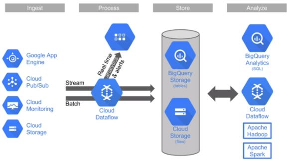
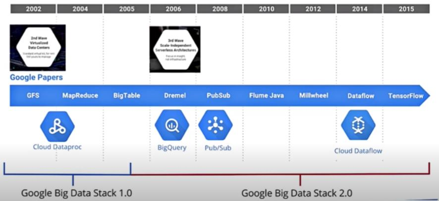
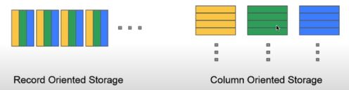

# Analyzing Data and Enabling Machine Learning: Big Query

## BigQuery Overview 

### What is BigQuery?
- Fully managed Data warehousing
  - Near-real time analysis of petabytes scale databases
- Serverless (no-ops)
- Auto-scaling to petabytes range
- Both storage and analysis
- Accepts batch and streaming loads
- Locations = multi-regional (US, EU), Regional (asia-northeast1)
- Replicated, durable
- Interact primariy with standard SQL (also Legacy SQL)  


### How BigQuery works?
- Part of the "3rd wave" of cloud computing: Google Big data stack 2.0
- Focus on serverless compute, real time insights, machine learning, ...
  - ... instead of data placement, cluster configuration
  - No managing of infrastructure, nodes, clusters, etc...
 
- Jobs (queries) can scale up to thousands of CPU's across many nodes, but the process is completely invisible to end user
- Storage and compute are separated, connected by petabit network
- Columnar data store
  - Separate records into column values, stores each value on different storage volumne
  - Traditional RDBMS stores whole record on one volumne
  - Extremely fast read performance, poor write (update) performance - BigQuery does not update existing records
  - Not transactional
 

### Bigquery structure
- Dataset - contains tables/views 
- Table - collection of columns 
- Job = long running action/query

### Identity and Access Management (IAM)
- Control by project, dataset and view
- Cannot control at table level, but can control by views via datasets as alternative (virtual table defined by SQL query)
- Predefined roles - BigQuery
    - Admin - full access
    - Data Owner - full dataset access
    - Data Editor - edit dataset tables
    - Data Viewer - view datasets and tables
    - Job User - run jobs
    - User - run queries and create datasets (but not tables)
- Role comparison matrix (https://cloud.google.com/bigquery/docs/access-control#predefined_roles_comparison_matrix)
- Sharding datasets: make public with All Authenticated Users

### Pricing 
- Storage, Queries, Streaming insert
- Storage = $0.02/GB/mo (first 10GB/mo free)
  - Long term storage (not edited for 90 days) = $0.01/GB/mo
- Queries = $5/TB (first TB/mo free)
- Streaming = $0.01/200MB
- Pay as you go, with high end flat-rate query pricing
- Flat rate - starts at $40K per month with 2000 slots

## Interacting with BigQuery
### Interaction methods
- Web UI
- Command line (bq commands)
  - bq query --arguments 'QUERY'
- Programmatic (REST API, client libraries)
- Interact via queries
- Querying tables
  - FROM `project.dataset.table` (Standard SQL)
  - FROM [project:dataset.table] (Legacy SQL)
### Searching multiple tables with wildcards
- Documentation: https://cloud.google.com/bigquery/docs/querying-wildcard-tables?hl=en
- Query across multiple, similarly named tables
  - FROM `project.dataset.table_prefix*`
- Filter further in Where clause
  - AND _TABLE_SUFFIX BETWEEN 'table003' and 'table050' 
  ```sql
  #standardSQL
    SELECT
        max,
        ROUND((max-32)*5/9,1) celsius,
        mo,
        da,
        year
    FROM
        `bigquery-public-data.noaa_gsod.gsod19*`
    WHERE
        max != 9999.9 # code for missing data
        AND _TABLE_SUFFIX BETWEEN '29'
        AND '40'
    ORDER BY max DESC
  ```
- Advanced SQL queries allowed: JOINS, sub queries, CONCAT
### Views
- Virtual table defined by query
- "Querying a query"
- Contains data only from query that contains view 
- Userful for limiting table data to others

### Cached queries
- Queries cost money
- Previous queries are cached to avoid charges if ran again
- Command line to disable cached results
  ```shell
  bq query --nouse_cach '(QUERY)'
  ```
- Caching is per user only

### User defined function (UDF)
- Combine SQL code with JavaScript/SQL function
- Combine SQL queries with programming logic
- Allow much more complex operations (loops, complex, conditionals)
- Web UI only usable with Legacy SQL
