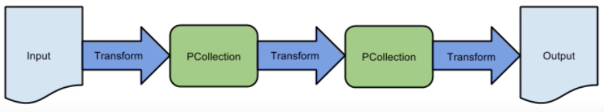

# Data Processing Pipelines

## Data Processing Challenges

### What is Data Processing?
  
- Read Data (input)
- Transform it to be relevant - Extract, Transform and Load (ETL)
- Create output
- Element-wise stream processing, each element is independently processed so you can do it as soon as it arrives
- Aggregations require all the data elements to be available in order to perform the operation and give and accurate answer (even when data comes in late or out of order)
  

### Challenge: Streaming and Batch data pipelines

- Until recently, separate pipelines required for each
- Difficult to compare recent and historical data
- One pipeline for "fast", another for "accurate"
- Why both? Compare streaming transactions to historical batch data to detect fraud

### Challenge: Unbounded data
- Unbounded data due to multitude of reasons: delay in the network, server crashed,...
- Element processing = single data input = once at a time, element ingested from single source
- Combining elements (aggregation)
- Processing data from different sources, streaming, and out of order (composite)
- Naturally, we could split streaming processing into processing time windows but not enough;

# GCP Solution: Apache Beam + Cloud Dataflow

## Cloud Dataflow
- Auto scaling, No-Ops, Stream and Batch Processing 
- Built on Apache Beam
  - Documentation refers to Apache Beam sit
  - Configuration is 100% code-based
- Integrates with other tools (GCP and external)
  - Natively - Pub/Sub, BigQuery, Cloud ML Engine
  - Connectors - BigTable, Apache Kafka
- Pipelines are regional-based


## Apache Beam
- Beam supports time-based shuffle (Windowing)
  
- Time based shuffling takes input data and treat time as key:
  - What we'd really like to have is to have event-time windowing;
  - As input is arriving, we are performing a time-based shuffle, to place the records into windows based on their event times
  - The way to do this in dataflow, is via Windowing API
  - Windowing divides events into finite time based chunks and lets you reason about them

## IAM
- Project-level only - all pipelines in project (or none)
- Pipeline data access separate from pipeline access 
- Dataflow admin - Full pipeline access + machine type/storage bucket config access
- Dataflow Developer - Full pipeline access, no machine type/storage bucket access 
- Dataflow Viewer - view permission only
- Dataflow Worker - Specifically for service accounts
  
## Dataflow vs Dataproc? Beam vs Hadoop/Spark?


<table class="tg">
  <tr>
    <th class="tg-op08">Workloads</th>
    <th class="tg-op08">Cloud Dataproc</th>
    <th class="tg-op08">Cloud DataFlow</th>
  </tr>
  <tr>
    <td class="tg-ncgp">Streaming processing (ETL)</td>
    <td class="tg-ncgp"></td>
    <td class="tg-ncgp">x</td>
  </tr>
  <tr>
    <td class="tg-ncgp">Batch processing (ETL)</td>
    <td class="tg-ncgp">x</td>
    <td class="tg-ncgp">x</td>
  </tr>
  <tr>
    <td class="tg-baqh">Iteractive processing and notebooks</td>
    <td class="tg-baqh">x</td>
    <td class="tg-baqh"></td>
  </tr>
  <tr>
    <td class="tg-baqh">Machine learning with Spark ML</td>
    <td class="tg-baqh">x</td>
    <td class="tg-baqh"></td>
  </tr>
  <tr>
    <td class="tg-baqh">Preprocessing for machine learning</td>
    <td class="tg-baqh"></td>
    <td class="tg-baqh">x (with Cloud ML Engine)</td>
  </tr>
</table>

## Key Concepts

#### Course/exam perspective
- DataFlow is very code-heavy
- Exam does not go deep into coding question
- Some key concepts/terminology will be tested

### Key terms
- Element - single entry of data (e.g. table row)
- PCollection - Distributed dataset, data input and output
- Transform - Data processing operation (or step) in pipeline 
  - uses programming conditionals (for/while loops, etc)
- ParDo - Type of transformation applied to individual elements 
  - Filter out/extract elements from large group of data


- PCollection and ParDo in example Java code - One step in a multi-step transformation process
```java
Pcollection<LaneInfo> currentConditions = p
    .apply("GetMessages", PubsubIO.readString().fromTopic(topic))
    .apply("ExtractData", ParDo.of(new DoFn<String, LaneInfo>(){
        @ProcessElement
        public void processElement(ProcessContext c) throws Exception {
            String line = c.element();
            c.output(LaneInfo.newLaneInfo(line));
        }
    }));
```

### Dealing with late/out of order data
- Latency is to be expected (network latency, processing time, etc)
- PubSub does not care about late data, that is resolved in Dataflow
- Resolved with Windows + Watermarks + Triggers
- Windows = logically divides element groups by time span
- Watermarks = "timestamp"
  - Event time = when data was generated 
  - Processing time = when data processed anaywhere in the processing pipeline
  - Can use PubSub-provided watermark or source-generated 
- Trigger = determine when results in window are emitted (submitted as completed)
  - Allow late-arriving data in allowed time window to re-aggregate previously submitted results
  - Timestamps, element count, combinations of both

## Additional Best Practices 
### Handling Pipeline Errors 
- If you do not have a mechanism in place to handle input data errors in your pipeline, the job can fail. How can we account for this?
- Gracefully catch errors
  - Create separate output
    - **Try-catch** block handles errors
    - Output errors to new **PCollection** - Send to 'collector' for later analysis (PubSub is a good target)
    - Think of it as 'recycling' the 'bad' data
- Technique is also valid for troubleshooting missing messages
  - Scenario: Streaming pipeline missing some messages
  - Solution: Run a batch of streaming data, check output
    - Create additional output to capture and process errors data. 


### Know your window types
- Global, Fixed, Sliding and Session
- Global - default single window for entire pipeline
- Fixed time - Every (x) period of time
  - Every 5 seconds, 10 minutes, etc
  
- Sliding time - Overlapping time windows
  
- Session - Within certain time of certain elements
  - Example: Time since last user/mouvse activity
  

### Updating DataFlow Pipelines
- Scenario: Update streaming Dataflow pipeline with new code
  - New code = new pipeline not compatible with current version
  - Need data to 'switch over' to new job/pipeline without losing any data in switch over
- Solution: Update job
  - Create new job with same name/new jobId
- Compability between old/new jobs
  - Map old to new job transforms with **transform mapping**
    - "Bridge" between old and new code base
  - After compability check - buffered data transferred to new job, using transform mapping to translate changes

