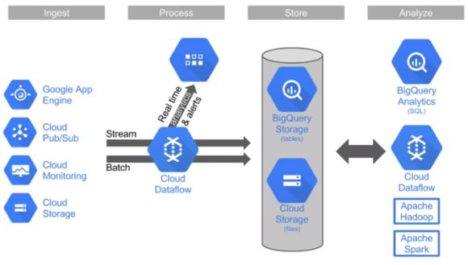
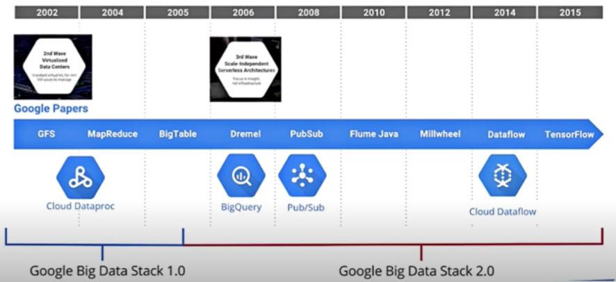
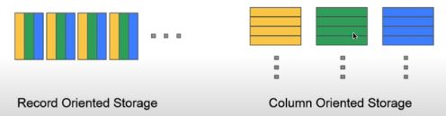
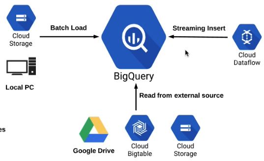
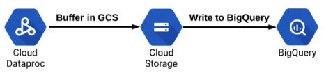

# Analyzing Data and Enabling Machine Learning: Big Query

## BigQuery Overview 

### What is BigQuery?
- Fully managed Data warehousing
  - Near-real time analysis of petabytes scale databases
- Serverless (no-ops)
- Auto-scaling to petabytes range
- Both storage and analysis
- Accepts batch and streaming loads
- Locations = multi-regional (US, EU), Regional (asia-northeast1)
- Replicated, durable
- Interact primariy with standard SQL (also Legacy SQL)  


### How BigQuery works?
- Part of the "3rd wave" of cloud computing: Google Big data stack 2.0
- Focus on serverless compute, real time insights, machine learning, ...
  - ... instead of data placement, cluster configuration
  - No managing of infrastructure, nodes, clusters, etc...
 
- Jobs (queries) can scale up to thousands of CPU's across many nodes, but the process is completely invisible to end user
- Storage and compute are separated, connected by petabit network
- Columnar data store
  - Separate records into column values, stores each value on different storage volumne
  - Traditional RDBMS stores whole record on one volumne
  - Extremely fast read performance, poor write (update) performance - BigQuery does not update existing records
  - Not transactional
 

### Bigquery structure
- Dataset - contains tables/views 
- Table - collection of columns 
- Job = long running action/query

### Identity and Access Management (IAM)
- Control by project, dataset and view
- Cannot control at table level, but can control by views via datasets as alternative (virtual table defined by SQL query)
- Predefined roles - BigQuery
    - Admin - full access
    - Data Owner - full dataset access
    - Data Editor - edit dataset tables
    - Data Viewer - view datasets and tables
    - Job User - run jobs
    - User - run queries and create datasets (but not tables)
- Role comparison matrix (https://cloud.google.com/bigquery/docs/access-control#predefined_roles_comparison_matrix)
- Sharding datasets: make public with All Authenticated Users

### Pricing 
- Storage, Queries, Streaming insert
- Storage = $0.02/GB/mo (first 10GB/mo free)
  - Long term storage (not edited for 90 days) = $0.01/GB/mo
- Queries = $5/TB (first TB/mo free)
- Streaming = $0.01/200MB
- Pay as you go, with high end flat-rate query pricing
- Flat rate - starts at $40K per month with 2000 slots

## Interacting with BigQuery
### Interaction methods
- Web UI
- Command line (bq commands)
  - bq query --arguments 'QUERY'
- Programmatic (REST API, client libraries)
- Interact via queries
- Querying tables
  - FROM `project.dataset.table` (Standard SQL)
  - FROM [project:dataset.table] (Legacy SQL)

### Searching multiple tables with wildcards
- Documentation: https://cloud.google.com/bigquery/docs/querying-wildcard-tables?hl=en
- Query across multiple, similarly named tables
  - FROM `project.dataset.table_prefix*`
- Filter further in Where clause
  - AND _TABLE_SUFFIX BETWEEN 'table003' and 'table050' 
  ```sql
  #standardSQL
    SELECT
        max,
        ROUND((max-32)*5/9,1) celsius,
        mo,
        da,
        year
    FROM
        `bigquery-public-data.noaa_gsod.gsod19*`
    WHERE
        max != 9999.9 # code for missing data
        AND _TABLE_SUFFIX BETWEEN '29' AND '40'
    ORDER BY max DESC
  ```
- Advanced SQL queries allowed: JOINS, sub queries, CONCAT
### Views
- Virtual table defined by query
- "Querying a query"
- Contains data only from query that contains view 
- Userful for limiting table data to others

### Cached queries
- Queries cost money
- Previous queries are cached to avoid charges if ran again
- Command line to disable cached results
  ```shell
  bq query --nouse_cach '(QUERY)'
  ```
- Caching is per user only

### User defined function (UDF)
- Combine SQL code with JavaScript/SQL function
- Combine SQL queries with programming logic
- Allow much more complex operations (loops, complex, conditionals)
- Web UI only usable with Legacy SQL

## Load and Export Data

### Loading and reading sources
 
- Data formats
  - Load: CSV, JSON (Newline delimited), Avro - best for compressed files, parquet, Datastore backups
  - Read: CSV, JSON (Newline delimited), Avro, parquet
- Why use external sources?
  - Load and clean data in one pass from external, then write to BigQuery
  - Small amount of frequently changing data to join to other tables
- Loading data with command line
  - **bq --location=[LOCATION] load --source_format=[FORMAT] [DATASET].[TABLE] [PATH_TO_SOURCE] [SCHEMA]**
  - Can load multiple files with command line (not WebUI)
  ```SQL
  bq load names.baby_names gs://(YOUR_BUCKET)/names/yob*.txt Name:STRING,Gender:STRING,Number:INTEGER
  ```
  - Load multiple files with command line to partitioned tables
    - Manual partition tables in BigQuery - Load multiple files to multiple tables: https://medium.com/bluekiri/manual-partition-tables-in-bigquery-375dfc5743 
    ```Shell
    bq --location=<LOCATION> load --skip_leading_rows 1 --source_format=CSV <DataSet>.<BQTable>_<State> $FileName state:STRING,gender:STRING,year:INTEGER,name:STRING,number:INTEGER
    ```
    - Load multiple files into single non-partitioned table
    ```SQL
    bq load names.baby_names gs://(YOUR_BUCKET)/names/yob*.txt Name:STRING,Gender:STRING,Number:INTEGER
    ```
    - Load multiple files into single partitioned table 

### Connecting to/from other Google Cloud services
- Dataproc - Use Bigquery connector (installed by default), job uses Cloud Storage for staging


### Exporting tables
- Can only export to Cloud Storage
- Can copy table to another BigQuery dataset
- Export formats: CSV, JSON, Avro
- Can export multiple tables with command line
- Can only export up to 1GB per file, but can split into multiple files with wildcards
- Command line
  - **bq extract 'projectid:dataset.table' gs://bucket_name/folder/object_name**
  - Can drop 'project' if exporting from same project
  - Default is CSV, specify other format with --destination_format
    - Ex: --destination_format=NEWLINE_DELIMITED_JSON

### BigQuery Transfer service
- Import data to BigQuery from other Google Advertising SaaS applications
- Google AdWords
- DoubleClick
- Youtube reports

## Optimize for Performance and Costs

### Performance and costs are complementary
- Less work = faster query = less costs
- What is 'work'?
  - I/O - how many bytes read?
  - Shuffle - how much passed to next stage?
  - How many bytes written?
  - CPU work in functions

### General best practices 
- Avoid using SELECT *
- Denormalize data when possible
  - Grouping data into single table 
  - Often with nested/repeated data
  - Good for read performance, not for write (transactional) performance
- Filter early and big with WHERE clause
- Do biggest joins first, and filter pre-JOIN
- LIMIT does not affect cost
- Partition data by date
  - Partition by ingest time
  - Partition by specified data columns
- Monitoring Query performance

## BigQuery Logging and Monitoring
### Differences between Stackdriver Monitoring/Stackdriver Logging
- Monitoring = performance/resources 
- Logging = who is doing what (History of actions)

### Monitoring BigQuery performance/resources
- Monitoring = Metrics, Performance, Resource capacity/usage (slots)
  - Query count, query times, slot utilization
  - Number of tables, stored and uploaded bytes over time
  - Alerts on metrics (ex: long query times)
    - Example: Alert when queries take more than 1 minute
  - No data on **who** is doing what, or query details

### Stackdriver Logging - 'paper trail'
- Logging = who is doing what
- Record of jobs and queries associated with accounts

## BigQuery Best Practices

### Data format for import
- Best performance = Avro format
- Scenario: Import multi-TB databases with millions of rows
  Avro - Compressed > Avro - Uncompressed

### Partitioned tables
- What is a partitioned table?
  - Special single table divided into segments - "partitions"
- Why is this important 
  - Query only certain rows (partitions) instead of entire table
    - Limits amount of read data
    - Improves performance 
    - Reduce costs
  - Partition types
    - Ingest time - when the data/row as created
    - Included TIMESTAMP or DATE column
  - Scenario: Large amount of data that is generated every day => need to query only certain time periods within same table
- Why not use multiple tables (one for each day) + wildcards?
  - Limited to 1000 tables per dataset
  - Substantial performance drop vs. single table

### Clustered tables
- Taking partitioned tables "to the next level"
- Similar to partitioning, divides table reads by a specified column field
  - Instead of dividing by date/time, divides by field
- Scenario: Logistics company needs to query by tracking IB
  - Cluster by tracking ID column = only reading table rows with specified tracking ID's
- Restriction: only (currently) available for partitioned tables

### Slots 
- Computational capacity required to run a SQL query
  - Bigger/more complex queries need more slots
- Default, on demand pricing allocates 2000 slots 
  - Only an issue for extremely complex queries, or high number of simultaneous users
  - If more than 2000 slots required, switch to **flat rate pricing**

### Backup and recovery
- Highly-available = multi-regional dataset vs. regional 
- Backup/recovery - BigQuery automatically takes continuous snapshot of tables
  - 7 days history - 2 days if purposely deleted
- Restore to previous point in time using '@(time)', in milliseconds
- Example: get snapshot from one hour ago
  ```sql
  SELECT * FROM [PROJECT_ID:DATASET.TABLE@-3600000]
  ```
- Alternatively, export table data to GCS, though not as cost effective.
