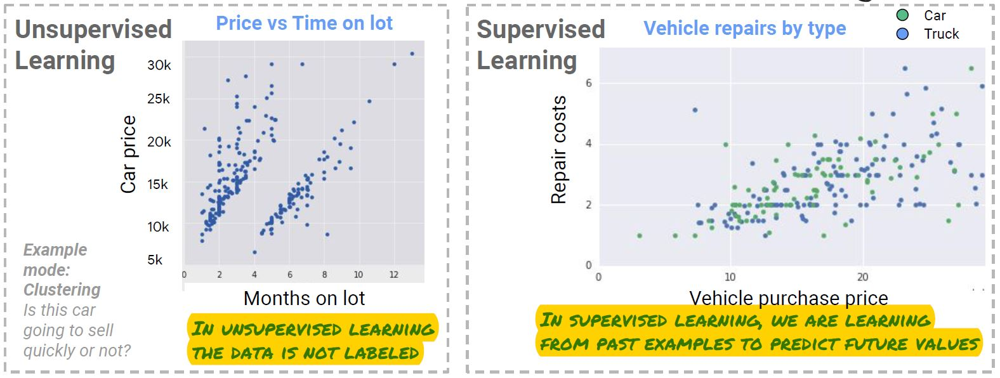
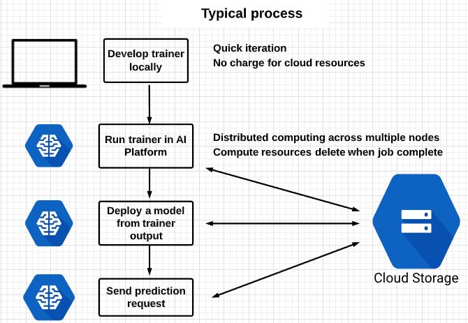
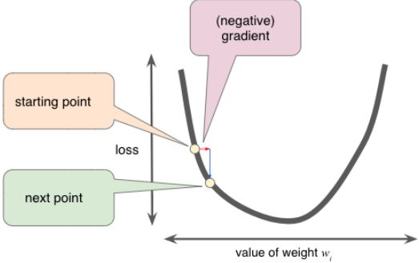
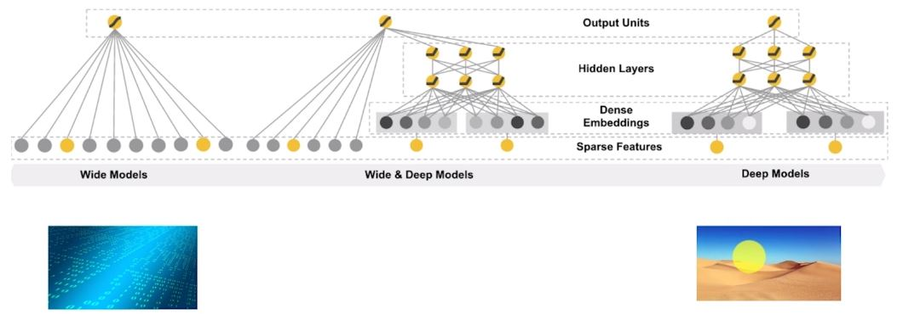
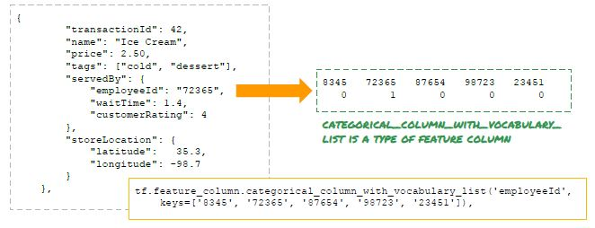

## What is Machine Learning (ML)?
- Machine learning is a way to use standard algorithms to derive predictive insights from data and make repeated decisions.
- backward-looking use of data - looking at historical data to create reports and dashboards
- Question about automating: 
  - make decision for every production in every region?
  - dynamically adjust the price? 
  - make decisions around predictive insights repeatable
- ML is about scaling up BI and decision making

### Stage 1: Train an ML model with examples
- The first stage of ML is to train an ML model with examples. 
- In this section, we focus on supervised learning which starts from examples. 
- An example consists of an input and a label (the true answer of this input). 
- The model is a mathematical function having a bunch of adjustable parameters. 

### Stage 2: Predict with trained model
- After the model is trained, we can use it to "predict" the label of input that it has never seen before. 

## Supervised vs Unsupervised learning

- With supervised models, we have labels, the correct answers to whatever it is that we want to learn to predict
- In unsupervised learning, the data does not have labels
    - Unsupervised problems are all about discovery, about looking at the raw data, and seeing if it naturally falls into groups. 

### Unsupervised Learning 
- Unsupervised learning is where only the input data (say, X) is present and no corresponding output variable is there.

#### Why Unsupervised Learning?
The main aim of Unsupervised learning is to model the distribution in the data in order to learn more about the data.

It is called so, because there is no correct answer and there is no such teacher(unlike supervised learning). Algorithms are left to their own devises to discover and present the interesting structure in the data.

#### Example of Unsupervised Learning
Suppose there is a basket and it is filled with some fresh fruits. The task is to arrange the same type of fruits at one place. There is no information about those fruits beforehand, it's the first time that the fruits are being seen or discovered

So how to group similar fruits without any prior knowledge about those.
First, any physical characteristic of a particular fruit is selected. Suppose color.

Then the fruits are arranged on the basis of the color. The groups will be something as shown below:
>RED COLOR GROUP: apples & cherry fruits.
>
>GREEN COLOR GROUP: bananas & grapes.

So now, take another physical character say, size, so now the groups will be something like this.
>RED COLOR AND BIG SIZE: apple.
>
>RED COLOR AND SMALL SIZE: cherry fruits.
>
>GREEN COLOR AND BIG SIZE: bananas.
>
>GREEN COLOR AND SMALL SIZE: grapes.

The job is done! Here, there is no need to know or learn anything beforehand. That means, no train data and no response variable. This type of learning is known as Unsupervised Learning.    

## Preventing Overfitted Training Models 

### What is Overfitting?
- Overfitting in ML is "the production of a model that corresponds **too closely or exactly** to a particular set of data (**training data set**), and may therefore **fail** to fit additional data (**test data set**) or predict future observations reliably"

### Causes of overfitting
- Not enought training data: Need more variety of samples
- Too many features: too complex
- Model fitted to unnecessary features unique to training data - a.k.a "Noise" 

### Solving for overfitted model
- MORE DATA!
    - Add more training data
    - Better generalize on variety
- Make model less complex by 
    - Using less (but more relevent) features
    - Combining multiple co-dependant/redundant features into single representative feature: Also helps reduce model training time
- Remove "noise": increase **regularization** parameters

### Regularization
- Adds a penalty to model as model becomes more complex
- Penalizes *parameters* = better generalize
- Cuts out "noise" and unimportant data to avoid overfitting

#### Regularization types: 
- **L1 and L2 regularization** - different approaches to tuning out noise. Each has different use case and purpose. 
- **L1** - Lasso Regression - assigns greater importance to **more influential features**
    - Shrinks less important features influence to zero
    - Good for models with many features, some more important than others
    - Example: Choosing features to predict likehood of home selling => House price more influential feature than carpet color. 
- **L2** - Ridge Regression - performs better when all the input features influence the output and all with weights are of **roughly equal size**

## ML Options on Google Cloud Platform
- Pre-trained ML models
- AI Platform: 
    - Train, deploy and manage custom ML models on managed infrastructure resources
    - You create the model and Google provide managed infrastructure for testing it. 
    - Distributed training and prediction: breaks job down into pieces, distributes to multiple workers
    - Automate the "annoying bits" of machine learning
    - Training automatically the model

## AI Platform
- Prepare trainer and data for the cloud: 
    - write training application in Tensorflow (or other ML library)
    - Python is language of choice
- Train your model with AI Platform
    - **Master** - manages other nodes
    - **Workers** - works on portion of training job
    - **Parameter servers** - coordinate shared model state between workers 

### Get Predictions - two types: 
- Online: 
    - High rate of requests with minimal latency
    - Give job data in JSON request string, predictions returned in its response message
- Batch:
    - Get inference (predictions) on large collections of data with minimal job duration
    - Input and output in Cloud Storage

### Key terminology in AI Platform
- Model - logical container individual solutions to a problem: 
    - Can deploy multiple version
- Version - instance of model
- Job - interactions with AI Platform
    - Train models: command = 'submit job train model' on AI Platform
    - Deploy trained models: command = 'submit job deploy trained model' on AI Platform
    - 'Failed' jobs can be monitored for troubleshooting

### Typical process

### IAM roles
- Project & Models
    - Admin - Full control
    - Developer - Create training/prediction jobs, models/versions, send prediction requests
    - Viewer - Read-only access to above
- Models only: 
    - Model Owner: full access to model and versions
    - Model User: Read models and use for prediction

### Using BigQuery for data source 
- Can read directly from BigQuery via training application
- Recommended to pre-process into Cloud Storage

## Working with Neural Networks

### Key terminology
- Neural network - model composed of layers, consisting of connected units (neurons): Learning from training datasets
- Neuron - node, combines input values and creates one output value
- Input - what you feed into a neuron 
- Feature - input variable used to make predictions
    - Detecting email spam (subject, keywords, sender address)
    - Identity animals (ears, eyes, colors, shapes)
- Hidden layer - set of neurons operating from same input set
- Feature engineering - deciding which features to use in a model
- Epoch - single pass through training dataset
    - Speed up training by training on a subset of data vs all data

### Making Adjustments with Parameters
- Weights - multiplication of input values
- Bias - value of output given a weight of O
- ML adjusts these parameters automatically
- Parameters = variables adjusted by training with data

### Rate of adjustments with Learning Rate
- Magnitude of adjustments of weights and biases 
- Hyperparameter = variables about the training process itself 
    - Also includes hidden layers 
    - Not related to training data
- Gradient descent - technique to minimize loss (error rate)
- Challenge is to find the correct learning rates:
    - Too small - takes forever
    - Too large - overshoots
    

### Deep and wide neural networks
- Wide - memorization: Many features
- Deep - generalization: Many hidden layers
- Deep and wide = both: Good for recommendation engines

## Features Engineering 

### Good features
- Should be related to the objective
    - Reasonable hypothesis for why feature value matters
    - Different problems in same domain may need different features
- Should be known at production-time
    - Feature value should be known at the time that the prediction is made
    - Causal: can not realy on future information
    - Legal/ethical to collect use that information
- Has to be numeric with meaningful magnitude
    - Non-numeric features can be used, it's just that we need to find a way to represent them in numeric form
- Has enough examples
    - Each value of each feature in dataset has to be understandable in context
- Brings human insight to problem 

### Categorical feature
- Raw data are converted to numeric features in different ways
- Overly specific attributes should be discarded
- Categorical values could be one-hot encoded 
    
    - employeeId=72365 would get one-hot encoded assuming that there are a total of 5 employees who could be doing the serving
    - Sparse-column-with-keys converts 72365 to an indexed-value (e.g 2) and one-hot-column changes it to (0-1-0-0-0)

### Bucketizing and Crossing
- The transformation of numeric features into categorical features, using a set of thresholds, is called bucketing (or binning)
- A feature cross is a synthetic feature formed by multiplying (crossing) two or more features. Crossing combinations of features can provide predictive abilities beyond what those features can provide individually.

### Wide and Deep 
- Two types of features: Dense and Sparse

- DNNs good for dense, higly correlated (**#question**)
- Linear for spare, independent features (**#question**)

### Hyperparameter tuning
- These parameters express “higher-level” properties of the model such as its complexity or how fast it should learn;
- Possible hyperparameters: batch size, epoch, learning rate, Number of hidden layers 
- Cloud MLE supports hyperparameter tuning: 
    - Make the parameter a command-line argument
    - Make sure outputs don't clobber each other
    - Supply hyperparameters to training job