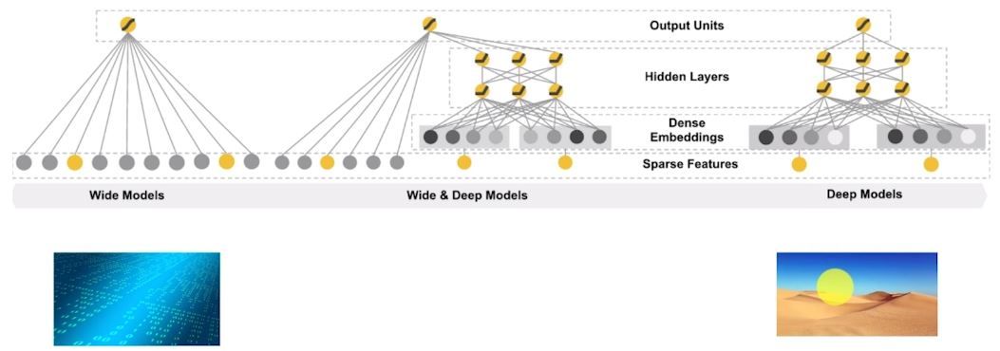

**1. A multi-national company wants to unify their data sources by building a universal centralized data warehouse instead of their current architecture in which every branch has its own and branches from other regions cannot access it. They want to build a data analytics team to extract data from all branches and build daily reports and dashboards to visualize the metrics required for C-Level managers to take decisions. The current data warehouses are all MySQL databases and analytics team will use SQL for data reporting. The company is distributed among different continents ( North America, Europe &amp; Asia). Which of the following approach is best suits to satisfy the company’s new data warehouse architecture?**

<ol type="A">
  <li>Use Cloud SQL to launch MySQL databases on each region. Enable cross-region read replication for each to sync between different regions.</li>
  <li>Use Cloud SQL to launch Multi-regional MySQL databases. Each in North America, Europe and Asia. Enable cross-region read replication for each to sync between different regions.</li>
  <li>Use BigQuery as a data warehouse and grant data analytics team editor roles.</li>
  <li>Use Cloud Spanner by launching a multi-regional database to be the company’s unified data warehouse.</li>
</ol>

> **The correct answer is Option D**
> 
> Cloud Spanner is a horizontally scalable, strongly consistent, relational database service. It’s built to combine the benefits of relational database structure with non-relational horizontal scale. This delivers high-performance transactions and strong consistency across rows, regions and continents.
> 
> <p><strong>Option A is incorrect.</strong> Launching MySQL databases on each region defeats the purpose of having a unified data warehouse.</p>
> 
> <p><strong>Option B is incorrect</strong>. Cloud SQL does not support multi-regional databases.</p>
> 
> <p><strong>Option C is incorrect</strong>. While BigQuery is a strong and potential alternative, BigQuery does not have horizontal scaling and it only covers USA &amp; Europe (<em>by the time of writing this question</em>). Another drawback is, BigQuery doesn’t support full data manipulation language (DML) and it has limitations on how rows can be updated or deleted.</p>
> 
> <p><strong>Option D is correct.</strong> Cloud Spanner is a relational database supports horizontal scaling across continents.</p>
> 
> <p><strong>Source(s) :</strong><a href="https://cloud.google.com/spanner/" target="_blank">Cloud Spanner</a>, <a href="https://cloud.google.com/bigquery/docs/locations" target="_blank">BigQuery dataset locations</a>, <a href="https://cloud.google.com/bigquery/docs/reference/standard-%20sql/data-manipulation-language" target="_blank">Bigquery: Data Manipulation Langauge</a></p>

**2. A fast-food chain restaurant wants to detect the different meal photos its customers upload to the different social media platforms tagged with their name in order to know what meals customers like and share the most for better quality analysis. It asks your advice on developing such solution for them.**

**However, they want it to be available and in production the soonest possible because they expect a high activity on their social media pages by the next public holiday which is coming in 2 weeks and marketing team finds it a great opportunity to receive feedback based on what customers say online. What is the best approach for this?**

<ol type="A">
  <li>Use AutoML Vision to build and train the model by using all the training photos you collected from food-chain’s social media pages for better results.</li>
  <li>Use AutoML Vision to build and train the model by using 50-70% of training photos you collected from food-chain’s social media pages while the rest of training set is to test and tune the model.</li>
  <li>Use Dataproc to build the model using SparkML. Use 50-70% of training photos you collected to train the model and the rest to test and tune the model. Deploy the model using Cloud ML Engine.</li>
  <li>Use Cloud ML Engine with TensorFlow to build the model. Use all training photos you collected to train the model. Deploy the model using Cloud ML Engine.</li>
</ol>

>**The correct answer is Option B**
>
>Since you have a very short time to build, train and deploy the model, building your own model can be time-consuming and not in your favor. Google provides a great ML service called AutoML to quickly build models for you. AutoML Vision is one of its products which you can start with a training set as little as a dozen photo samples and AutoML takes care of the rest.
>
><strong>Option A is incorrect</strong>. AutoML Vision is the right choice. However, training the model with whole training set is not the right approach in Machine Learning because you ought to test the model before considering it accurate enough for production. Usually, training set is split into 70-30% sets, first for training while the second is for testing and tuning the model’s parameters.
>
><strong>Option C is incorrect</strong>. Using any approach other than AutoML can be time-consuming and with such tight deadline, it’s not the best approach.
>
><strong>Option D is incorrect</strong>. Using this approach can also be time-consuming and using the whole training set for training is not a best practice as explained before.
>
>Thus, the best approach for this scenario is Option B.
>
><strong>Source(s) :</strong> <a href="https://cloud.google.com/automl/" target="_blank">Google Cloud AutoML</a>, <a href="https://cloud.google.com/ml-engine/" target="_blank">Cloud Machine Learning Engine</a>

**3. A financial services firm providing products such as credit cards and bank loans receives thousands of online applications from clients applying for their products. Because it takes a lot of effort to scan and check all applications if they meet the minimum requirements for the products they are applying for, they want to build a machine learning model takes application fields like annual income, marital status, date of birth, occupation and other attributes as input and finds out if the applicant is qualified for the product the client applied for. Which of the following the machine learning technique will help to build such model?**

<ol type="A">
  <li>Regression</li>
  <li>Classification</li>
  <li>Clustering</li>
  <li>Reinforcement learning</li>
</ol>

>**The correct answer is Option B.**
>
>**A regression problem** is a problem which its output variable is of continuous value. Problems which finds out about variables such as weights, prices or age are considered regression problems. A **classification problem** is a problem which the output variable is a category. Examples of classification problems are finding a passenger’s nationality, detect if a patient is diagnosed with a disease or if an applicant is qualified for a job interview. Regression and classification are supervised learning problems. It means, the machine learns from past experiences by training it on a labeled data set. A training set is a set of rows with input and output parameters. The machine then learns from the training set and improves its parameters for better detection.
>
>**Clustering** is an unsupervised learning method. An unsupervised learning is a method to find references between input data without labeled output. The purpose is to find meaningful structure between the input sets with similar features and group them. Clustering is the method of grouping data points share similarities and separating dissimilar points to other groups. Examples of clustering applications are customer segmentation (new, frequent, loyal, ..), city land value and detecting anomalies in network traffic.
>
>**Reinforcement learning** is a technique which a machine takes actions without training sets to reach the highest rewards possible. The agent learns from trial and decides what to do to perform a given task without supervision. The task punishes the agent for a wrong action and rewards it for achieving the task. Examples of reinforcement learning is asking an agent to play a maze game to reach the exit with traps along the way or making an agent play a video game and win a racing game.
>
>From the explanation above, we can see the scenario problem which finding if a client is qualified for a product is a classification problem. So, option B is correct.

**4. You have built a machine learning model to classify if a customer would buy a certain product when recommended by the company’s website. You trained the model with a sample set. Upon testing the model, you found out only 28% of the testing sets are actually true positives and the model isn’t very accurate. You figured out the model is over-fitted. How would you solve this?**

<ol type="A">
  <li>Increase training data, increase feature parameters &amp; increase regularization.</li>
  <li>Decrease training data, decrease feature parameters &amp; increase regularization.</li>
  <li>Increase training data, decrease feature parameters &amp; increase regularization</li>
  <li>Increase training data, decrease feature parameters &amp; decrease regularization.</li>
</ol>

> **The correct answer is Option C.**
>
> Overfitting happens when a model performs well on a training dataset, generating only a small error, while giving wrong output for the test dataset. This happens because the model is only picking up specific features input found in the training set instead of picking out general features of the given training set.
> To solve overfitting, the following would help improving the model's quality: 
> - Increase the number of examples, the more data a model is trained with, the more use cases the model can be training on and better improves its predictions. 
> - Tune hyperparameters which is related to number and size of hidden layers (for neural networks), and regularization, which means using techniques to make your model simpler such as dropout method to remove neuron networks or adding "penalty" parameters to the cost function.
> - Remove features by removing irrelevant features. Feature engineering is a wide subject and feature selection is a critical part of building and training model. Some algorithms have built-in feature selection, but in some cases, data scientists need to cherry-pick or manually select or remove features for debugging and finding the best model output. 
>
> From the brief explanation, to solve the overfitting problem in the scenario, you need to choose option C. 
  
**5. A coach line bus service company wants to predict how many passengers they expect to book for tickets on their buses for the upcoming months. This helps the company to know how many buses they need to be in service for maintenance and fuel and how many drivers to be available. The company has data sets of all booked tickets since its launch in 1968 and it allows private sharing of the data if this helps the prediction process.**

**You will build the machine learning model for the coach line company. Which technique you will use to predict the number of passengers in the next months?**

<ol type="A">
  <li>Regression</li>
  <li>Association</li>
  <li>Classification</li>
  <li>Clustering</li>
</ol>

>**Answer: A**
>
>A regression problem is a problem which its output variable is of continuous value. Problems which finds out about variables such as weights, prices or age are considered regression problems. A classification problem is a problem which the output variable is a category. Examples of classification problems are finding a passenger’s nationality, detect if a patient is diagnosed with a disease or if an applicant is qualified for a job interview. Regression and classification are supervised learning problems. It means, the machine learns from past experiences by training it on a labeled data set. A training set is a set of rows with input and output parameters. The machine then learns from the training set and improves its parameters for better detection.
>
>Association is a rule-learning technique for discovering interesting relations between variables in large data sets. Example of association rules is discovering regularities between products in large-scale transaction data recorded by point-of-sales for a retail chain store.</p>
>
>Clustering is an unsupervised learning method. An unsupervised learning is a method to find references between input data without labeled output. The purpose is to find meaningful structure between the input sets with similar features and group them. Clustering is the method of grouping data points share similarities and separating dissimilar points to other groups. Examples of clustering applications are customer segmentation (new, frequent, loyal, ..), city land value and detecting anomalies in network traffic.
>
>From the explanation above, the technique to help solving the scenario is Answer A: Regression.

**6. A video-on-demand company wants to generate subtitles for its content on the web. They have over 20.000 hours of content to be subtitled and their current subtitle team cannot catch up with the every-growing video hours the content team keep adding to the website library. They want a solution to automate this as man power can be expensive and may take long time. Which service of the following can greatly help the automation of video subtitles?**

<ol type="A">
  <li>Cloud Natural Language</li>
  <li>Cloud Speech-to-Text</li>
  <li>AutoML Vision API</li>
  <li>Machine Learning Engine</li>
</ol>

>**Answer: B**
>
></strong>Answer A is incorrect: </strong>Cloud natural language service is to derive insights from unstructured text revealing meaning of the documents and categorize articles. It won’t help extracting captions from videos.
>
><strong>Answer B is correct</strong>: Cloud Speech-to-Text is a service to generate captions from videos by detecting speakers language and speech.
>
><strong>Answer C is incorrect: </strong>AutoML Vision API is a service to recognize and derive insights from images by either using pre-trained models or training a custom model based on a set of photographics.
>
><strong>Answer D is incorrect</strong>: Machine Learning Engine is a managed service letting developers and scientists build their own models and run them in production. This means, you have to build your own model to generate text from videos which needs much effort and experience to build such model. So, it’s not a practical solution for this scenario.
>
>Source(s): <a href="https://cloud.google.com/natural-language/" target="_blank">Google NLP</a>, <a href="https://cloud.google.com/ml-engine/" target="_blank">Google Machine Learning Engine</a>, <a href="https://cloud.google.com/vision" target="_blank">Google Vision API</a>, <a href="https://cloud.google.com/speech-to-text/" target="_blank">Google Speech-to-Text API</a>

**7. An online learning platform wants to generate captions for its videos. The platform offers around 2,500 courses with topics about business, finance, cooking, development &amp; science. The platform allows content with different languages such as French, German, Turkish and Thai. Thus, this can be very difficult for a single team to caption all available courses and they are looking for an approach which helps do such massive job. Which product from Google Cloud will you suggest them to use?**

<ol type="A">
  <li>Cloud Speech-to-Text</li>
  <li>Cloud Natural Language</li>
  <li>Machine Learning Engine</li>
  <li>AutoML Vision API</li>
</ol>

>**Answer: A**
>
><strong>Answer A is correct</strong>: Cloud Speech-to-Text is a service to generate captions from videos by detecting speakers language and speech.</p>
>
><strong>Answer B is incorrect</strong>: Cloud natural language service is to derive insights from unstructured text revealing meaning of the documents and categorize articles. It won’t help extracting captions from videos.</p>
>
><strong>Answer C is incorrect:</strong> Machine Learning Engine is a managed service letting developers and scientists build their own models and run them in production. This means, you have to build your own model to generate text from videos which needs much effort and experience to build such model. So, it’s not a practical solution for this scenario.</p>
>
><strong>Answer D is incorrect</strong>: AutoML Vision API is a service to recognize and derive insights from images by either using pre-trained models or training a custom model based on a set of photographics.</p>
>
>Source(s): <a href="https://cloud.google.com/natural-language/" target="_blank">Google NLP</a>, <a href="https://cloud.google.com/ml-engine/" target="_blank">Google Machine Learning Engine</a>, <a href="https://cloud.google.com/vision" target="_blank">Google Vision API</a>, <a href="https://cloud.google.com/speech-to-text/" target="_blank">Google Speech-to-Text API</a>

**8. You have a dataflow pipeline reads a CSV file daily at 6am, applies the needed cleansing &amp; transformation on it, then loads it to BigQuery. Occassionally, the CSV file might be modified within the day due to human error or incomplete data. This causes you to manually re-run dataflow pipeline again. Is there a way to fix this by automatically re-run the pipeline if file has been modified?**

<ol type="A">
  <li>Use Cloud Scheduler to re-run dataflow after 6am. Check what is the average time the file is modified and schedule based on it</li>
  <li>Use Dataproc to reprocess the file after 6am. You can use Cloud Functions to launch a Dataproc cluster.</li>
  <li>Use Cloud Composer to rerun dataflow and reprocess the file. Create a custom sensor to detect file condition if changed.</li>
  <li>Use a compute engine to schedule a cron job to run every 10 minutes to check if the file was modified to rerun dataflow.</li>
</ol>

>Answer: C
>
><p>Cloud Composer is a fully managed workflow orchestration service built on Apache Airflow. Cloud composer is built specifically to schedule and monitor workflows and take required actions. You can use Cloud Composer to orchestrate dataflow pipeline and create a custom sensor to detect file’s condition if any changes occurred, then it triggers the dataflow pipeline to run again.</p>
>
><strong>Answer A is incorrect</strong>: Guessing what time scheduler should rerun dataflow is not efficient.</p>
>
><strong>Answer B is incorrect</strong>: Dataproc is unnecessary in this scenario. <strong>Answer D is incorrect:</strong> This solution is viable, but Answer C has a better and more efficient design.</p>
>
>Source(s): <a href="https://cloud.google.com/composer/" target="_blank">Cloud Composer</a></p>

**9. A dairy products company is using sensors installed around different areas in its farms to monitor employees activities and detect any intruders. Apache Kafka cluster is used to gather the events coming from sensors. Recently, Kafka cluster is becoming a bottleneck causing lag in receiving sensor events. Turns out sensors are sending more frequent events and due to the company expanding with more farms, more sensors are installed and this will cause extra load on the cluster. What is the most resilient approach to solve this issue?**

<ol type="A">
  <li>Use pub/sub to ingest and stream sensor events.</li>
  <li>Scale out Kafka cluster to withstand the continuously flowing event stream.</li>
  <li>Spin up a new Kafka cluster and distribute sensors even streams between the two clusters.</li>
  <li>Build a Dataflow pipeline to ingest the events stream.</li>
</ol>

>**Answer: A**
>
>Cloud Pub/Sub is a service to ingest event streams at any scale. It’s scalable and reliable for stream analytics and event-driven computing systems. So it’s the most reliable Google product for such scenario.</p>
>
><strong>Answers B &amp; C are wrong</strong> because these are not scalable solutions.</p>
>
><strong>Answer D is wrong</strong> because Dataflow cannot ingest event streams. It needs Pub/Sub service to do so.</p>
>
><strong>Source(s): </strong><a href="https://cloud.google.com/pubsub/docs/overview" target="_blank">Google Pub/Sub</a></p>

<strong>10. A social media platform stores various details of their platform users such as session login time, URLs visited, activities on platform and other logs. With GDPR (General Data Protection Regulation) compliance to be officially implemented, the platform now allows users to download their activity logs from their profile settings which they can click a button to call an API to generate a full report.

Recently, users are complaining timeouts after 60 seconds of requesting to download their activity logs at peak hours when the platform has the most traffic. They have to try for several minutes or even hours for the API to return their report available for download.

How can you solve this issue?</strong>

<ol type="A">
  <li>Increase timeout for API at peak times to 120 seconds. If it keeps failing, try increasing the timeout until the issue is resolved.</li>
  <li>Build a Dataflow pipeline to generate daily reports of users’ activity logs. Users can download those daily reports whenever they want to.</li>
  <li>Migrate data source to Cloud Spanner for horizontal scaling to avoid query timeouts.</li>
  <li>Use Pub/sub to pull the requests for activity logs from users. Send a link to users by their email addresses with a temporary download link for them to access their report.</li>
</ol>

>**Answer: D**
>
>Cloud Pub/Sub is a service to ingest event streams at any scale. It’s scalable and reliable for stream analytics and event-driven computing systems.
>
>Pub/sub is a good product to de-couple a system’s components so they communicate with each other asymmetrically. From the scenario shown here, instead of directly calling the API to export required report which puts great loads on the API and hence the timeouts faced by users. Instead, the platform can “publish” messages to a “topic” related to exporting activity log reports sending the required parameters such as user ID and custom settings such as date range and what data to export. The API can be switched to be a “subscriber” which receives the messages sent and processes each message asymmetrically to generate the report, then sends the download link to the user’s mailbox when ready.
>
>Hence, answer D is correct.
>
><strong>Answer A is incorrect</strong>: Increasing timeout isn’t a scalable solution and it may keep occurring eventually when more and more users join the platform.
>
><strong>Answer B is incorect</strong>: While this would solve the timeout issues, generating daily reports for users can be costly as more users join, knowing that requesting activity log reports are a non-frequent action and this costs both compute and storage resources. This solution also doesn’t provide flexibility with what parameters the report is generated on such as date range and other custom metrics.</p>
>
><strong>Answer C is incorrect: </strong>This solution has several issues. First, we’re assuming the data source is a relational database, which can be unlikely since NoSQL databases better perform for massive log input which uses the user ID as a key to reach the data. Second, Cloud Spanner isn’t a cheap solution for a service not frequently used.</p>

**11. A company decides to migrate its on-premise data infrastructure to the cloud mainly for high availability of cloud services and to lower the high costs of storing data on-premise. The infrastructure uses HDFS to store data and be processed and transformed using Apache Hive &amp; Spark. The company wants to migrate the infrastructure and DevOps team still wants to administrate the infrastructure in the cloud. As a data architect, which of the following is the approach recommended by Google?**

<ol type="A">
  <li>Use Dataproc to process the data. Store data in Google Storage.</li>
  <li>Build a Dataflow pipeline. Store the data in Google Storage. Use Cloud Compute to launch instances and install the required dependencies for processing the data.</li>
  <li>Use Dataproc to process the data. Store data in Dataproc’s HDFS.</li>
  <li>Build a Dataflow pipeline. Store the data in persistent disks in HDFS. Execute the code in Spark framework provided by Dataflow</li>
</ol>

>**Answer: A**
>
>Dataproc is cloud-native Apache Hadoop &amp; Apache Spark service. Dataproc is a fully-managed service from Google to run Apache Hadoop &amp; Spark clusters. Dataflow is a simplified streaming/batching data processing service. With Apache Beam, it provides rich set of windowing and session analysis primitives as well as an ecosystem of source &amp; sink connectors.
>
><strong>Answer B is incorect:</strong> Dataflow is serverless which may not suit DevOps requirement to fully manage the pipeline and it’s unnecessary to use Cloud Compute for installing dependencies. <strong>Answer C is incorrect:</strong> Dataproc’s HDFS is volatile, means it will be removed when the cluster is deleted. Dataproc clusters can be kept up indefinitely but this may lead to high costs which defeats the purpose of migration.
>
><strong>Answer D</strong>: In addition to what discussed in answer B, storing data using persistent disks can be only accessible by Compute engines and it’s more expensive than storing in Google Storage.
>
>Answer A fulfills the requirements for migrating the on-premise infra to the cloud with high availability, minimum costs and full control by DevOps.

**12. A multi-international company has multiple Google Storage buckets in different regions around the world. Each branch has its own set of buckets in the region nearest to them to avoid latencies. However, this led to a problem for analytics team to reach and do the necessary reports on the data using BigQuery since they need to create the tables in the same region either to import the data or create external tables to access the data in different regions. The head of data decided to sync the data daily from different Google Storage buckets scattered in different regions to a single multi-regional bucket to do the necessary data analysis and reporting. Which service could help with this approach?**

<ol type="A">
  <li>Appliance Transfer Service</li>
  <li>gsutil</li>
  <li>Storage Transfer Service</li>
  <li>Dataflow</li>
</ol>

>**Answer: C**
>
>Storage Transfer Service allows you to quickly import <em>ONLINE </em>data into Cloud Storage. You can also set up a repeating schedule for transferring data, as well as transfer data within Cloud Storage, from one bucket to another.
>
>Transfer Appliance is an <em>OFFLINE </em>secure, high capacity storage server that you set up in your datacenter. You fill it with data and ship it to an ingest location where the data is uploaded to Google Cloud Storage.
>
>So, answer C is correct, while answer <strong>A is incorrect.</strong></p>
>
><strong>Answer B is incorrect: </strong>gsutil tool is good for programmatic usage by developers and may be useful to copy and move megabytes/gigabytes of data not so practical for Terabytes of data. It’s also not reliable data transfer technique as it is related to the machine’s connectivity with Google Cloud.</p>
>
><strong>Answer D is incorrect:</strong> Dataflow as a solution may be viable, but you need to build a pipeline to migrate data from bucket to another. Storage Transfer Service can do it without the extra effort.
>
><strong>Source(s) :</strong> <a href="https://cloud.google.com/storage-transfer/docs/" target="_blank">Google Cloud Storage Transfer Service</a>, <a href="https://cloud.google.com/transfer-appliance/" target="_blank">Google Appliance Transfer Service</a>

**13. A company is migrating its current infrastructure from on-premise to Google cloud. It stores over 280TB of data on its on-premise HDFS servers. You were tasked to move data from HDFS to Google Storage in a secure and efficient manner. Which of the following approaches are best to fulfill this task?**

<ol type="A">
  <li>Install Google Storage gsutil tool on servers and copy the data from HDFS to Google Storage.</li>
  <li>Use Cloud Data Transfer Service to migrate the data to Google Storage.</li>
  <li>Import the data from HDFS to BigQuery. Then, export the data to Google Storage in AVRO format.</li>
  <li>Use Transfer Appliance Service to migrate the data to Google Storage.</li>
</ol>

>**Answer: D**
>
>Storage Transfer Service allows you to quickly import <em>ONLINE </em>data into Cloud Storage. You can also set up a repeating schedule for transferring data, as well as transfer data within Cloud Storage, from one bucket to another.
>
>Transfer Appliance is an <em>OFFLINE </em>secure, high capacity storage server that you set up in your datacenter. You fill it with data and ship it to an ingest location where the data is uploaded to Google Cloud Storage.
>
>So, answer D is the correct one, while<strong> B is incorrect.</strong>
>
><strong>Answer A is incorrect:</strong> gsutil tool is good for programmatic usage by developers and may be useful to copy and move megabytes/gigabytes of data. Not so practical for Terabytes of data. It’s also not reliable data transfer technique as it is related to the machine’s connectivity with Google Cloud.
>
><strong>Answer C is incorrect</strong>: In order to migrate to BigQuery, you need to migrate data to Google Storage. This is a useless approach as the main challenge is migrating data from HDFS to Google Storage and BigQuery won’t help solving it.</p>
>
><strong>Source(s):</strong> <a href="https://cloud.google.com/storage-transfer/docs/" target="_blank">Google Cloud Storage Transfer Service</a>, <a href="https://cloud.google.com/transfer-appliance/" target="_blank">Google Appliance Transfer Service</a>, <a href="https://cloud.google.com/solutions/migration/hadoop/hadoop-gcp-%20migration-data" target="_blank">Migrate HDFS to Google Storage</a>. 

**14. A company is moving its data center from its on-premise servers to the cloud. It was estimated that they have about 2 Petabytes of data to be moved and security team is very concerned the data should be migrated securely and project manager has a timeline of 6 months for the whole migration to be done. Which of the following approaches is best to do the job?**

<ol type="A">
  <li>Appliance Transfer Service.</li>
  <li>Google Storage (Coldline).</li>
  <li>Cloud Transfer Service.</li>
  <li>Datastore</li>
</ol>

>**Answer: A**
>
>Storage Transfer Service allows you to quickly import <em>ONLINE </em>data into Cloud Storage. You can also set up a repeating schedule for transferring data, as well as transfer data within Cloud Storage, from one bucket to another.
>
>Transfer Appliance is an <em>OFFLINE </em>secure, high capacity storage server that you set up in your datacenter. You fill it with data and ship it to an ingest location where the data is uploaded to Google Cloud Storage.
>
>So, answer A is the correct one, while<strong> C is incorrect.</strong>
>
><strong>Answer B is incorrect: </strong>Google Storage Coldline is a way to store archive data not frequently accessed cheaply in the cloud. It won’t help migrating data to the cloud.
>
><strong>Answer D is incorrect:</strong> Datastore is a NoSQL database built for automatic scaling and high performance. It won’t help with this scenario.
>
><strong>Source(s):</strong> <a href="https://cloud.google.com/storage-transfer/docs/" target="_blank">Google Cloud Storage Transfer Service</a>, <a href="https://cloud.google.com/transfer-appliance/" target="_blank">Google Appliance Transfer Service</a>, <a href="https://cloud.google.com/solutions/migration/hadoop/hadoop-gcp-%20migration-data" target="_blank">Migrate HDFS to Google Storage</a>, <a href="https://cloud.google.com/storage/docs/storage-classes" target="_blank">Google Storage Classes</a>

**15. You have the following legacy SQL query in BigQuery:**

```SQL
# legacy SQL
SELECT order_date, 
    COUNT(DISTINCT customer_id)) AS customers
FROM [my-project:orders.orders_2018]
GROUP BY order_date
ORDER BY order_date:
```

**How can you convert this query to standard SQL?**

<ol type="A">
  <li>Change table syntax to `my-project:orders.orders_2018`</li>
  <li>Change table syntax to `my-project.orders.orders_2018`</li>
  <li>Change table syntax to [my-project.orders.orders_2018]</li>
  <li>No change required. This works fine if standard SQL is enabled.</li>
</ol>

>**Answer: B**
>
>Source: <a href="https://cloud.google.com/bigquery/docs/reference/standard-%20sql/migrating-from-legacy-sql%23subqueries_in_more_places" target="_blank">Migrating from Legacy to Standard SQL</a>

**16. What is the keyword in BigQuery standard SQL used when selecting from multiple tables with wildcard by their suffices?** 

<ol type="A">
  <li>_WILDCARD_SUFFIX</li>
  <li>_TABLES_SUFFIX</li>
  <li>_SUFFIX</li>
  <li>_TABLE_SUFFIX</li>
</ol>

>**Answer: D**
>
>To restrict the query so that it scans an arbitrary set of tables, use the <em>_TABLE_SUFFIX </em>pseudo column in the WHERE clause. The <em>_TABLE_SUFFIX </em>pseudo column contains the values matched by the table wildcard.
>
>Source: <a href="https://cloud.google.com/bigquery/docs/querying-wildcard-tables" target="_blank">Bigquery – Querying wildcard tables</a>

**17. You have the following BigQuery legacy SQL query :**

```SQL
SELECT SUM (amount)
FROM TABLE_DATE_RANGE ([some-dataset.orders_],
    TIMESTAMP (‘2017-06-01’),
    TIMESTAMP (‘2017-09-01’);
```

**How can you convert it to standard SQL?**

A. 
```SQL
SELECT SUM(amount)
FROM `some-dataset.orders_*`
    WHERE TABLE_DATE_RANGE BETWEEN ‘20170601’ AND ‘20170901’;
```
B. 
```SQL
SELECT SUM(amount)
FROM `some-dataset.orders_*`
    WHERE _TABLE_SUFFIX BETWEEN ‘20170601’ AND ‘20170901’;
```
C. 
```SQL
SELECT SUM(amount)
FROM `some-dataset.orders_`
    WHERE _TABLE_SUFFIX BETWEEN ‘20170601’ AND ‘20170901’;
```
D. 
```SQL
SELECT SUM(amount)
FROM `some-dataset.orders_*`
    WHERE _TABLE_DATE_RANGE BETWEEN ‘20170601’ AND ‘20170901’;
```

>**Answer: B**
>
>To restrict the query so that it scans an arbitrary set of tables, use the <em>_TABLE_SUFFIX </em>pseudo column in the WHERE clause. The <em>_TABLE_SUFFIX </em>pseudo column contains the values matched by the table wildcard.
>
>TABLE_DATE_RANGE queries daily tables that overlap with the time range between <em> </em>and . This function is a <em>LEGACY </em>SQL function.

**18. A weather forecasting facility receives events from its 25,000 sensors every 10 seconds. Those events are stored in Google Storage in JSON format. Events can have different attributes based on purpose, location and brand. Data Science team wants to apply their SQL-queries on this data for further transformation and forecasting analysis. Which of the following approaches is best to satisfy Data Scientists request?**

<ol type="A">
  <li>Load the data directly to BigQuery with enabling “auto-detect” option.</li>
  <li>Build a dataflow pipeline to read JSON data and transform it to a structured format like CSV. Then, load the data to BigQuery.</li>
  <li>Import the data to BigTable. Choose combination #eventType-location-brand to differentiate between different events.</li>
  <li>Use Dataproc cluster and create Hive external clusters on the data for data scientists to query data.</li>
</ol>

>**Answer: A**
>
>Description:
>
>Schema auto-detection: Schema auto-detection is available when you load data into BigQuery, and when you query an external data source. When auto-detection is enabled, BigQuery starts the inference process by selecting the file in the data source and scanning up to 100 rows of data to use as a representative sample. BigQuery then examines each field and attempts to assign a data type to that field based on the values in the sample. BigQuery makes a best-effort attempt to automatically infer the schema for CSV and JSON files.
>
>So, answer A is the correct answer. The other answers are complicated and unnecessary approaches for this scenario.
>
><p><strong>Source: </strong><a href="https://cloud.google.com/bigquery/docs/schema-detect" target="_blank">BigQuery – Auto-detect schema</a></p>

**19. An environment safety facility receives thousands of events every 60 seconds from its sensors assembled in different sectors monitoring air pollution in the region. Scientists want to access and query the data for observation and daily reporting. Due to current funding state, their budget is limited and they seek a cost-effective, highly available and ACID-compliant solution supports SQL querying. Which approach would you recommend for such scenario?**

<ol type="A">
  <li>Use BigQuery to store and query the event data. Enable streaming on BigQuery for data to be loaded in real-time.</li>
  <li>Batch-load data into BigTable with launching 10 nodes to allow high performance.</li>
  <li>Use Cloud SQL to load events into a relational database and allow access to scientists to query.</li>
  <li>Use BigQuery to store and query event data. Batch load the data to BigQuery using its API.</li>
</ol>

>**Answer: D**
>
>BigQuery supports both batch &amp; streaming data. However, due to mentioned budget restrictions, the solution would choose the cheaper approach, which is batching data to BigQuery. Batching data to BigQuery is free of charge. Streaming data on the other hand is charged by size.</p>
>
>So, answer D is correct. <strong>Answer A is incorrect </strong>for this scenario. <strong>Answer B is incorrect</strong>: BigTable does not support SQL querying.
>
><strong>Answer C is incorrect</strong>: Cloud SQL needs administration and not easily scalable. Cloud SQL does not provide batching tools. BigQuery is a better approach for such scenario.
>
><strong>Source(s) :</strong><a href="https://cloud.google.com/bigquery/streaming-data-into-bigquery" target="_blank">Bigquery: Streaming data</a>, <a href="https://cloud.google.com/bigquery/batch" target="_blank">Bigquery: Batch data</a>, <a href="https://cloud.google.com/bigquery/pricing" target="_blank">Bigquery Pricing</a>

**20. Analytics team receives data from different data sources stored in Google Storage. The team wants to query the data for required ETL operations which they will fully take care of it using SQL. They want your advice on what is the best approach recommended by Google to do it. What would you suggest?**

<ol type="A">
  <li>Batch load the data from Google Storage into BigQuery using its batch API, run cleansing and transformation queries on data and insert the transformed rows to another BigQuery table.</li>
  <li>Batch load the data from Google Storage into BigQuery using its batch API, run cleansing and transformation queries on data and export the data to Google Storage. Launch Dataproc cluster and use Hive to query the transformed data.</li>
  <li>Create external tables on data using BigQuery, apply the cleansing and transformation queries on data then load the output to an internal BigQuery table for reporting and visualization.</li>
  <li>Create external tables on data using BigQuery, apply the cleansing and transformation queries on data then load the output to BigTable for reporting and visualization.</li>
</ol>

>**Answer: C**
>
>An external data source (also known as a federated data source) is a data source that you can query directly even though the data is not stored in BigQuery. Instead of loading or streaming the data, you create a table that references the external data source.
>
>Querying an external data source using a temporary table is useful for one-time, ad-hoc queries over external data, or for extract, transform, and load (ETL) processes.
>
>In summary, using external tables in BigQuery is useful for such cases:
>- Perform ETL operations on data.
>- Frequently changed data.
>- Data is being ingested periodically.
>
><strong>Answer C is the correct answer</strong> based on above explanation and using BigQuery for reporting and visualization is a better approach.
>
><strong>Answer D is incorrect</strong> because BigTable isn’t a practical (and cheap) approach to report and visualize data.
>
><strong>Answers A &amp; B are incorrect</strong>: Based on Google’s best practices, using external tables for ETL is better than loading data to BigQuery.
>
><strong>Source(s) :</strong><a href="https://cloud.google.com/bigquery/external-data-sources" target="_blank">BigQuery external tables</a>, <a href="https://cloud.google.com/bigquery/external-table-definition" target="_blank">BigQuery – Define external tables</a></p>

**21. What is the HBase Shell for Cloud Bigtable?**

<ol type="A">
  <li>The HBase shell is a GUI based interface that performs administrative tasks, such as creating and deleting tables.</li>
  <li>The HBase shell is a command-line tool that performs administrative tasks, such as creating and deleting tables.</li>
  <li>The HBase shell is a hypervisor based shell that performs administrative tasks, such as creating and deleting new virtualized instances.</li>
  <li>The HBase shell is a command-line tool that performs only user account management functions to grant access to Cloud Bigtable instances.</li>
</ol>

>**Answer: B**
>
>The HBase shell is a command-line tool that performs administrative tasks, such as creating and deleting tables. The Cloud Bigtable HBase client for Java makes it possible to use the HBase shell to connect to Cloud Bigtable.
>
><strong>Source(s): </strong><a href="https://cloud.google.com/bigtable/docs/installing-hbase-shell" target="_blank">Hbase Shell</a>

**22 (*Q68*). What is the recommended action to do in order to switch between SSD and HDD storage for your Google Cloud Bigtable instance?**

<ol type="A">
  <li>Create a third instance and sync the data from the two storage types via batch jobs.</li>
  <li>Export the data from the existing instance and import the data into a new instance.</li>
  <li>Run parallel instances where one is HDD and the other is SDD.</li>
  <li>The selection is final and you must resume using the same storage type.</li>
</ol>

>**Answer: B**
>
>When you create a Cloud Bigtable instance and cluster, your choice of SSD or HDD storage for the cluster is permanent. You cannot use the Google Cloud Platform Console to change the type of storage that is used for the cluster.
>
>If you need to convert an existing HDD cluster to SSD, or vice-versa, you can export the data from the existing instance and import the data into a new instance.
>
>Alternatively, you can write - a Cloud Dataflow or Hadoop MapReduce job that copies the data from one instance to another.
>
><strong>Source(s): </strong><a href="https://cloud.google.com/bigtable/docs/choosing-ssd-hdd" target="_blank">Choosing SSD vs HDD for BigTable</a>


**23. Which of the following is NOT a valid use case to select HDD as the storage for GCP Bigtable**

<ol type="A">
  <li>You expect to store at least 10TB of data.</li>
  <li>You will mostly run batch workloads with scans and writes, rather than frequently executing random reads of a small number of rows.</li>
  <li>You need to integrate with Google BigQuery.</li>
  <li>You will not use the data to back an user-facing or latency-sensitive application.</li>
</ol>

>**Answer: C**
>
>For example, if you plan to store extensive historical data for a large number of remote-sensing devices and then use the data to generate daily reports, the cost savings for HDD storage may justify the performance tradeoff. On the other hand, if you plan to use the data to display a real-time dashboard, it probably would not make sens to use HDD storage, reads would be much more frequent in this case, and reads are much slower with HDD storage. 
>
><strong>Source(s): </strong><a href="https://cloud.google.com/bigtable/docs/choosing-ssd-hdd" target="_blank">Choosing SSD vs HDD for BigTable</a>

**24. You are building a data pipeline on GCP. You need to select services that will host a deep neural network machine learning model also hosted on GCP. You also need to monitor and run jobs that could occasionally fail. What should you do?**

<ol type="A">
  <li>Use the Cloud Machine Learning Engine to host your model. Monitor the status of the Jobs object for 'failed' job states.</li>
  <li>Use the Cloud Machine Learning Engine to host your model. Monitor the status of the Operation object for 'error' results</li>
  <li>Use a Kubernetes Engine cluster to host your model. Monitor the status of the Jobs object for 'failed' job states.</li>
  <li>Use a Kubernetes Engine cluster to host your model. Monitor the status of the Operation object for 'error' results.</li>
</ol>

>**Answer: A**
>
>You would host your model and correctly monitor Jobs for failures with Cloud ML Engine. Using Kubernetes Engine is a choice but it's not the optimal solution while having Cloud ML Engine.  

**25. You are designing storage for event data as part of building a data pipeline on GCP. You want to minimize the cost of querying individual values over time windows. Which storage service and schema design should you use?**

<ol type="A">
  <li>Use Cloud Bigtable for storage. Design tall and narrow tables, and use a new row for each single event version.</li>
  <li>Use Cloud Bigtable for storage. Design short and wide tables, and use a new column for each single event version.</li>
  <li>Use Cloud Storage for storage. Join the raw file data with a BigQuery log table.</li>
  <li>Use Cloud Storage for storage. Write a Cloud Dataprep job to split the data into partitioned tables.</li>
</ol>

>**Answer: A**
>
>A tall and narrow table has a small number of events per row, which could be just one event, whereas a short and wide table has a large number of events per row. As explained in a moment, tall and narrow tables are best suited for time-series data.
>
>For example, suppose you take the temperature in your vegetable garden each morning. Now if you decide that, because you take the temperature each morning, one row per day is appropriate; as a result, your table is tall and narrow. Note that the timestamp isn't the first element of the row key. As explained later, using a timestamp as the first element of a row key can cause a variety of problems. 
>
>**For time series, you should generally use tall and narrow tables**. This is for two reasons: Storing one event per row makes it easier to run queries against your data. Storing many events per row makes it more likely that the total row size will exceed the recommended maximum.
>
>**As an optimization, you can use short and wide tables, but avoid unbounded numbers of events**. For example, if you usually need to retrieve an entire month of events at once, the temperature table above is a reasonable optimization—the row is bounded in size to the number of days in a month.

**26. How can you set up your Dataproc environment to use BigQuery as an input and output source?**

<ol type="A">
  <li>Use the Bigtable syncing service built into Dataproc.</li>
  <li>Manually use a Cloud Storage bucket to import and export to and from both BigQuery and Dataproc.</li>
  <li>You can only use Cloud Storage or HDFS for your Dataproc input and output.</li>
  <li>Install the BigQuery connector on your Dataproc cluster.</li>
</ol>

>**Answer: D**

**27. What is the difference between a deep and wide neural network? What would you use a deep AND wide neural network for?**

<ol type="A">
  <li>Wide models are used for generalizations. Deep models are for memorization.</li>
  <li>Deep and wide models are ideal for solving regression problems.</li>
  <li>Wide models are used for memorization. Deep models are for generalization</li>
  <li>Deep and wide models are ideal for a recommendation application.</li>
</ol>

>**Answer: CD**


**28. You need to run analytical queries using SQL syntax against data formatted in JSON format. What should you do? Choose the best answer.**

<ol type="A">
  <li>Load your JSON data into Cloud SQL, and run queries against it in that service.</li>
  <li>Load your JSON data into Cloud Storage. Add your JSON table as an external read source in BigQuery, since BigQuery is unable to store data in JSON format.</li>
  <li>Import the data into Bigtable and use Bigtable for your queries.</li>
  <li>Import the data in JSON format into BigQuery as a table, and run queries against it.</li>
</ol>

>**Answer: D**

**29. You are configuring your Cloud Pub/Sub subcription. Assuming that all requirements are met, which subcription delivery method offers better 'near real-time' delivery of messages?**

<ol type="A">
  <li>Pull</li>
  <li>Push</li>
  <li>Cached</li>
  <li>Instant</li>
</ol>

>**Answer: B**
>
>Pub/Sub can either **push** messages to subcribers, or subscribers can **pull** messages from Pub/Sub;
>- Push = lower latency, more real-time
>- Push subcribers must be Webhook endpoints that accept POST over HTTPS
>- Pull ideal for large volumne of messages - batch delivery

**30. You want to export your Cloud SQL Tables into BigQuery for analysis. How can you do this?**

<ol type="A">
  <li>Convert your Cloud SQL data to JSON format, then import directly into BigQuery</li>
  <li>Export your Cloud SQL data to Cloud Storage, then import into BigQuery</li>
  <li>Import data from BigQuery directly from Cloud SQL.</li>
  <li>Use the BigQuery export function in Cloud SQL to manage exporting data into BigQuery.</li>
</ol>

>**Answer: B**

**31. You are setting up Cloud Dataproc to perform some data transformations using Apache Spark jobs. The data will be used for a new set of non-critical experimentations in your marketing group. You want to setup a cluster that can transform a large amount of data in the most cost-effective way. What should you do?**

<ol type="A">
  <li>Set up a cluster in High Availability mode with default machine types. Add 10 additional Preemptible worker nodes.</li>
  <li>Set up a cluster in Standard mode with high-memory machine types. Add 10 additional Preemptible worker nodes.</li>
  <li>Set up a cluster in Standard mode with the default machine types. Add 10 additional local SSDs.</li>
  <li>Set up a cluster in High Availability mode with high-memory machine types. Add 10 additional local SSDs.</li>
</ol>

>**Answer: B**

**32. Your organization needs to be able to reliably handle ever-increasing amounts of streaming telemetry data, process it, and economically store analyzed data. What services should they use for this task?**

<ol type="A">
  <li>Stackdriver, Cloud Dataproc, Cloud Spanner.</li>
  <li>Cloud Pub/Sub, Cloud Dataproc, Bigtable.</li>
  <li>Cloud Pub/Sub, Cloud Dataflow, Bigquery.</li>
  <li>Kubernetes Engine, Cloud Dataflow, Cloud Datastore.</li>
</ol>

>**Answer: C**

**33. You are migrating a Hadoop cluster to Cloud Dataproc using GCS for storage. After migration, some of your existing, more complex Spark jobs (in parquet format) are performing noticably worse than your on-premises cluster. You are using mostly preemptible VM's (with a few required nonpreemptible) in order to save on costs.**

<ol type="A">
  <li>Change your file format to CSV format</li>
  <li>Increase the size of your cluster by twice as many preemptible VM's</li>
  <li>Switch disks from HDD to SSD. Change the default preemptible VM settings to increase the size of the boot disk.</li>
  <li>Switch your disks from HDD to SSD, run the job in HDFS before copying the results back to GCS.</li>
  <li>Ensure that your parquet files are at an optimized block size.</li>
</ol>

>**Answer: C**
>
>By default, pre-emptible node disk sizes are limited to 100GB or the size of the non-preemptible node disk sizes, whichever is smaller. However you can override the default preemptible disk size to any requested size. Since the majority of our cluster is using preemptible nodes, the size of the disk used for caching operations will see a noticeable performance improvement using a larger disk. Also, SSD's will perform better than HDD. This will increase costs slightly, but it's the best option available while maintaining costs. 
>
>**E is incorrect**. While the block size of parquet files does have an impact on performance in a complex Spark job, these are the same jobs and configurations that were run on the on-premises Hadoop cluster. The change in performance in two different environments with identical job configurations does not indicate a job configuration or file format issue. .

**34. You are creating a machine learning model for predicting a person's income given a variety of factors such as age, race, occupation, and others. What type of problem are we trying to solve in our prediction values?**

<ol type="A">
  <li>Classification</li>
  <li>Unsupervised learning</li>
  <li>Clustering</li>
  <li>Linear Regression</li>
</ol>

>**Answer: D**

**35. What is the recommended minimum amount of data to store in BigTable?**

<ol type="A">
  <li>500 GB</li>
  <li>1 GB</li>
  <li>10 TB</li>
  <li>500 TB</li>
</ol>

>**Answer: C**
>Google recommends that workloads of less than 1TB should not be used in Bigtable, especially form a cost/value perspective. 

<strong>36. You need to choose a structure storage option for storing very large amounts of data with the following properties and requirements:
- The data has a single key
- You need very low latency Which solution should you choose</strong>

<ol type="A">
  <li>BigTable</li>
  <li>Data Store</li>
  <li>Cloud SQL</li>
  <li>BigQuery</li>
</ol>

>**Answer: A**
>
>Bigtable uses a single key and has very low latency (in milliseconds). It is the best choice. Datastore stores less data than Bigtable, and operates on multiple keys.

**37. You need to replicate the logs that are ingested by your on-premise Apache Kafka cluster to Google Cloud to be stored for analysis in BigQuery. What should you do?**

<ol type="A">
  <li>Create an identical Kafka cluster on Compute Engine in GCP. Configure your on-premises Kafka cluster to duplicate all data to the GCP Kafka cluster. Use a Dataflow job to process data from Kafka and insert into BigQuery.</li>
  <li>Configure the Pub/Sub Kafka connector on your on-premises Kafka cluster, and configure Pub/Sub as a source connector. Use a Cloud Dataflow job to read from a subscribed Pub/Sub topic and write to BigQuery</li>
  <li>Create a Cloud Composer workflow to manage the replication of data from your Kafka cluster directly into BigQuery.</li>
  <li>Configure the Pub/Sub Kafka connector on your on-premises Kafka cluster, and configure Pub/Sub as a sink connector. Use a Cloud Dataflow job to read from a subscribed Pub/Sub topic and write to BigQuery</li>
</ol>

>**Answer: D**

**38. You have a Dataflow job that keeps failing due to errors in your input data. What steps can you take to improve pipeline reliability while at the same time, capturing failed data for reprocessing?**

<ol type="A">
  <li>Implement a try-catch block that transforms the both good and bad data. Create an additional output by using a new PCollection that can be output to Pub/Sub which can then be placed into GCS for further analysis.</li>
  <li>Filter out errors as they occur, and view error entries using Stackdriver Logging</li>
  <li>Implement a try-catch block that transforms the both good and bad data, and extract the incorrect entries from Stackdriver Logging.</li>
  <li>Implement a try-catch block that transforms the both good and bad data. Publish the erroneous data to Pub/Sub, which can then be placed into GCS for further analysis.</li>
</ol>

>**Answer: A**
>
>Your pipeline needs to use an additional side output, that uses a PCollection to output errorenous data to Pub/Sub.
>
>The option D is almost correct, however it's not complete.

**40. You work at very large organizations that has a very large analyst team. You use the default pricing model for BigQuery. During heavy usage, your analyst group occasionally runs out of the 2000 slots available for the BigQuery jobs. You do not want to create additional projects for the sole purpose of inscreasing slot count. What can you do to resolve this problem?**

<ol type="A">
  <li>You must create an additional project to increase your slot count, then spread the BigQuery loads across both projects.</li>
  <li>Force-enable the 'use cached results' option for all available queries.</li>
  <li>Switch to flat rate pricing to enable a higher total slot quota for your project.</li>
  <li>Use the quotas page to increase your BigQuery slot count to 3000 as needed.</li>
</ol>

>**Answer: C**

**41. You are selecting a streaming service for log messages that must include final result message ordering as part of building a data pipeline on Google Cloud. You want to stream input for 5 days and be able to query the most recent message value. You will be storing the data in a searchable repository. How should you set up the input messages?**

<ol type="A">
  <li>Use Apache Kafka on Compute Engine for input. Attach a timestamp to every message in the publisher.</li>
  <li>Use Cloud Pub/Sub for input. Attach a unique identifier to every message in the publisher.</li>
  <li>Use Apache Kafka on Compute Engine for input. Attach a unique identifier to every message in the publisher.</li>
  <li>Use Cloud Pub/Sub for input. Attach a timestamp to every message in the publisher.</li>
</ol>

>**Answer: D**
>
>The option A is technically possible but not optimal because we have Google Cloud Pub/Sub already for this use case. 

**42. You need to deploy a TensorFlow machine-learning model to Google Cloud. You want to maximize the speed and minimize the cost of model prediction and deployment. What should you do?**

<ol type="A">
  <li>Export 2 copies of your trained model to a SavedModel format. Store artifacts in Cloud Storage. Run 1 version on CPUs and another version on GPUs.</li>
  <li>Export 2 copies of your trained model to a SavedModel format. Store artifacts in Cloud ML Engine. Run 1 version on CPUs and another version on GPUs.</li>
  <li>Export your trained model to a SavedModel format. Deploy and run your model from a Kubernetes Engine cluster.</li>
  <li>Export your trained model to a SavedModel format. Deploy and run your model on Cloud ML Engine.</li>
</ol>

>**Answer: D**

**41. Your organization has migrated their Hadoop workloads to Cloud Dataproc. To fully take advantage of the cloud, you want to decouple your Hadoop storage and compute, and be able to destroy your cluster when compute is complete in order to save costs while preserving your data. What should you do?**

<ol type="A">
  <li>You must use another processing framework such as Apache Beam for this task.</li>
  <li>Copy your data from HDFS to Cloud Storage. Update your scripts to point to the Cloud Storage location (gs://) instead of the HDFS location (hdfs://). Within your Dataproc job, configure output to output to Cloud Storage.</li>
  <li>Use the Dataproc sync tool to synchronize HDFS with GCS.</li>
  <li>You must leave your managed Dataproc cluster running in order to access computer data.</li>
</ol>

>**Answer: C**

**42. Your organization needs to develop their machine learning model to control topology definitions. There are a large number of possible configurations to achieve the best results. What components of their machine learning model would they adjust to account for increased complexity? (Choose two answers.)**

<ol type="A">
  <li>Learning rate</li>
  <li>Neurons</li>
  <li>Epoch</li>
  <li>Hidden layers</li>
</ol>

>**Answer: B&D**
>
>Epoch is a pass through the training dataset, not related to complexity. 

**43. Your company’s aging Hadoop servers are nearing end of life. Instead of replacing your hardware, your CIO has decided to migrate the cluster to Google Cloud Dataproc. A direct lift and shift migration of the cluster would require 30 TB of disk space per individual node. There are cost concerns about using that much storage. How can you best minimize the cost of the migration?**

<ol type="A">
  <li>Decouple storage from computer by placing the data in Cloud Storage</li>
  <li>Place archived data in Cloud Storage, and only use 'hot' data in HDFS on the cluster disks</li>
  <li>Implement maximum data compression to reduce the amount of disk space your data uses.</li>
  <li>Use preemptible VM's to save costs on cluster storage usage.</li>
</ol>

>**Answer: A**
>
>Placing all input and output data in Cloud Storage allows you to 1. Treat clusters as ephemeral and 2. Use a much cheaper storage location compared to persistent disks without a noticeable impact on performance.

**44. You are setting up multiple MySQL databases on Compute Engine. You need to collect logs from your MySQL applications for audit purposes. How should you approach this?**

<ol type="A">
  <li>Configure Cloud Composer to monitor and report on instance performance metrics.</li>
  <li>Install the Stackdriver Logging agent on your database instances and configure the fluentd plugin to read and export your MySQL logs into Stackdriver Logging.</li>
  <li>Install the Stackdriver Monitoring agent on your instances, configure the MySQL plugin, and export logs to Stackdriver Monitoring.</li>
  <li>Configure Stackdriver Logging to natively monitor application logs, which will appear in Stackdriver Logging.</li>
</ol>

>**Answer: B**

**45. Your organization is ready to migrate their Hadoop workloads to Google Cloud. For the data migration, they need a cost-effective 'data lake' that will scale to their growing data needs and be able to easily connect to their Hadoop workloads in the cloud. What two actions should they perform?**

<ol type="A">
  <li>Install the Bigtable connector in the on-premises Hadoop cluster, then migrate data to Bigtable for long-term storage.</li>
  <li>Add the Cloud Storage connector to their on-premises Hadoop environment, and transfer their data to a Cloud Storage bucket.</li>
  <li>For the existing Hadoop jobs that are migrating to Dataproc, use the gs:// prefix instead of hdfs:// to access data from Cloud Storage.</li>
  <li>Create a Dataproc cluster for long-term use, and transfer data to the HDFS partition on the cluster.</li>
</ol>

>**Answer: B&C**

**46. You are working on a project with two compliance requirements. The first requirement states that your developers should be able to see the Google Cloud Platform billing charges for only their projects. The second requirement states that your finance team members can set budgets and view the current charges for all projects in the organization. The finance team should not be able to view the project contents. You want to set permissions. What should you do?**

<ol type="A">
  <li>Add the finance team to the Viewer role for the Project. Add the developers to the Security Reviewer role for each of the billing accounts.</li>
  <li>Add the developers and finance managers to the Viewer role for the Project.</li>
  <li>Add the finance team members to the default IAM Owner role. Add the developers to a custom role that allows them to see their spending only.</li>
  <li>Add the finance team members to the Billing Administrator role for each of the billing accounts that they need to manage. Add the developers to the Viewer role for the Project.</li>
</ol>

>**Answer: D**

**47. You are training a machine learning model to predict the liklihood of rain based on an available dataset of weather data. In reviewing your input data, the amount of humidity in the air has a very strong influence on the chance of rain, especially compared to less relevant data. How can you incorporate this more important data to that it properly influences the model?**

<ol type="A">
  <li>Create a feature from the humidity data point, and use L2 regularization to optimize the model.</li>
  <li>Tune your hyperparameters to give greater weighting to the humidty feature over others.</li>
  <li>Create a feature from the humidity data point, and use L1 regularization to optimize the model.</li>
  <li>Reduce your epochs except for humidity features.</li>
</ol>

>**Answer: C**
>
>- **L1 and L2 regularization** - different approaches to tuning out noise. Each has different use case and purpose. 
>- **L1** - Lasso Regression - assigns greater importance to **more influential features**
>    - Shrinks less important features influence to zero
>    - Good for models with many features, some more important than others
>    - Example: Choosing features to predict likehood of home selling => House price more influential feature than carpet color. 
>- **L2** - Ridge Regression - performs better when all the input features influence the output and all with weights are of **roughly equal size**

**48. Your organization is making the move to Google Cloud. You need to bring your existing big data processing workflows to the cloud without having to re-train employees on new products. Your organization uses the Apache Hadoop ecosystem for big data processing. Which Google Cloud managed service would your workflow move to?**

<ol type="A">
  <li>Cloud Dataproc.</li>
  <li>Cloud Bigtable.</li>
  <li>Cloud Pub/Sub.</li>
  <li>Cloud Dataflow.</li>
</ol>

>**Answer: A**

**49. In order to protect live customer data, your organization needs to maintain separate operating environments —development/test, staging, and production— to meet the needs of running experiments, deploying new features, and serving production customers. What is the best practice for isolating these environments while at the same time maintaining operability?**

<ol type="A">
  <li>Create separate organization accounts for each environment, and use domain wide IAM roles to allow access between each organization environment to share data as needed.</li>
  <li>Create a separate project for dev/test, staging, and production. Migrate relevant data between projects when ready for the next stage.</li>
  <li>Place all three environments in the same project, however, use separate Cloud Storage buckets, Cloud ML Engine clusters, and other services for each environment</li>
  <li>Place resources into the same project. but use object versioning in Cloud Storage in order to separate data by environment.</li>
</ol>

>**Answer: B**

**50. You want to display aggregate view counts for your YouTube channel data in Data Studio. You want to see the video tiles and view counts summarized over the last 30 days. You also want to segment the data by the Country Code using the fewest possible steps. What should you do**

<ol type="A">
  <li>Export your YouTube views to Cloud Storage. Set up a Cloud Storage data source for Data Studio. Set Views as the metric and set Video Title and Country Code as report dimensions.</li>
  <li>Export your YouTube views to Cloud Storage. Set up a Cloud Storage data source for Data Studio. Set Views as the metric and set Video Title as a report dimension. Set Country Code as a filter.</li>
  <li>Set up a YouTube data source for your channel data for Data Studio. Set Views as the metric and set Video Title as a report dimension. Set Country Code as a filter.</li>
  <li>Set up a YouTube data source for your channel data for Data Studio. Set Views as the metric and set Video Title and Country Code as report dimensions.</li>
</ol>

>**Answer: D**
>
>There is no need to export; you can use the existing YouTube data source. Country Code is a dimension because it's a string and should be displayed as such, that is, showing all countries, instead of filtering.

**51. Your BigQuery dataset contains 1500 tables. When conducting a query, you are limited to a maximum of 1000 tables that you can query at once. You need to query data across all 1500 tables. What should you do?**

<ol type="A">
  <li>Place tables into separate datasets.</li>
  <li>If possible, merge the 1500 tables to bring the total number below 1000. You may still partition single tables to divide data for queries.</li>
  <li>Export the data to Bigtable, and conduct your query inside of Bigtable.</li>
  <li>Create multiple views of chunks of the 1500 tables, then query the multiple views.</li>
</ol>

>**Answer: B**
>
>If you have over 1000 tables, you need to bring that number to below 1000 to query all of them at once. Merge tables, then use table partitioning to divide single tables into segments (called partitions), as long they are partitioned by time.

**52. You are building a data pipeline on Google Cloud. You need to prepare source data for a machinelearning model. This involves quickly deduplicating rows from three input tables and also removing outliers from data columns where you do not know the data distribution. What should you do?**

<ol type="A">
  <li>Use Cloud Dataprep to preview the data distributions in sample source data table columns. Write a recipe to transform the data and add it to the Cloud Dataprep job.</li>
  <li>Write an Apache Spark job with a series of steps for Cloud Dataflow. The first step will examine the source data, and the second and third steps will perform data transformations.</li>
  <li>Use Cloud Dataprep to preview the data distributions in sample source data table columns. Click on each column name, click on each appropriate suggested transformation, and then click Add to add each transformation to the Cloud Dataprep job.</li>
  <li>Write an Apache Spark job with a series of steps for Cloud Dataproc. The first step will examine the source data, and the second and third steps will perform data transformations.</li>
</ol>

>**Answer: C**

**53. Which of these is NOT a type of trigger that applies to Dataflow?**

<ol type="A">
  <li>Element size in bytes.</li>
  <li>Element count.</li>
  <li>Combinations of other triggers.</li>
  <li>Timestamp.</li>
</ol>

>**Answer: A**

**54. What types of Bigtable row keys can lead to hotspotting? (Choose all that apply)**

<ol type="A">
  <li>Leading with a non-reversed timestamp.</li>
  <li>Standard domain names (non-reversed).</li>
  <li>Reverse timestamps.</li>
  <li>Non-sequential numeric IDs.</li>
</ol>

>**Answer: A & B**

**55. Your organization is streaming telemetry data into BigQuery for long-term storage (2 years) and analysis, at the rate of about 100 million records per day. They need to be able to run queries against certain time periods of data without incurring the costs of querying all available records. What is the preferred method for doing so?**

<ol type="A">
  <li>Create a single table, but query only individual rows by data in the WHERE clause.</li>
  <li>Use a LIMIT clause to limit the number of rows queried based on WHERE clause criteria.</li>
  <li>Partition a single table by day, and run queries against individual partitions.</li>
  <li>Create a new table, one for each day. Run queries against the groups of tables relevant to their needs.</li>
</ol>

>**Answer: C**

**56. You created a job which runs daily to import higly sensitive data from an on-premise location to Cloud Storage. You also setup a streaming data insert into Cloud Storage via a Kafka node that is running on a Compute Engine instance. You need to encrypt the data at rest and supply your own encryption key. Your key should not be stored in the Google Cloud. What should you do?**

<ol type="A">
  <li>Upload your own encryption key to Cloud Key Management Service, and use it to encrypt your data in your Kafka node hosted on Compute Engine.</li>
  <li>Create a dedicated service account, and use encryption at rest to reference your data stored in Cloud Storage and Compute Engine data as part of your API service calls.</li>
  <li>Upload your own encryption key to Cloud Key Management Service, and use it to encrypt your data in Cloud Storage. Use your uploaded encryption key and reference it as part of your API service calls to encrypt your data in the Kafka node hosted on Compute Engine.</li>
  <li>Supply your own encryption key, and reference it as part of your API service calls to encrypt your data in Cloud Storage and your Kafka node hosted on Compute Engine.</li>
</ol>

>**Answer: D**

**57. You have in your possession a database of financial transactions, which include a user's name, location, purchase location, and purchase amount. With this data, what two types of machine learning can potentially applied to this dataset?**

<ol type="A">
  <li>Apply supervised regressing learning to label which transactions are likely to be fraudulent.</li>
  <li>Apply unsupervised learning to label which transactions are likely to be fraudulent.</li>
  <li>Unsupervised learning to identify patterns (clustering) in the data to predict the location of future purchases.</li>
  <li>Apply reinforcement learning to predict the location of purchase.</li>
  <li>Apply labels to the data based on whether it is fraudulent or not-fraudulent. Then apply supervised classification learning to predict which future transactions are likely to be fraudulent.</li>
</ol>

>**Answer: C&E**

**58. What will happen to your data in a Bigtable instance if a node goes down?**

<ol type="A">
  <li>Bigtable will attempt to rebuild the data from RAID disk configuration when the node comes back online.</li>
  <li>Nothing, as the storage is separated from the node compute.</li>
  <li>Lost data will automatically rebuild itself from Cloud Storage backups when the node comes back online.</li>
  <li>Apply reinforcement learning to predict the location of purchase.</li>
  <li>Data will be lost, which makes regular backups to Cloud Storage necessary.</li>
</ol>

>**Answer: B**

**59. You are a consultant for several organizations. Each organization has data in their own BigQuery table within a single project. For application access reasons, all of the tables must remain in the same project. You want to give access to each organization to view and run queries against their own data without exposing the data of organizations to unauthorized viewers. What should you do?**

<ol type="A">
  <li>You must separate the tables by project, and use a service account in your application to access data in each project. Give out project-wide roles to each organization.</li>
  <li>Place the tables in a single dataset, and apply IAM roles to each table, limiting access per table to each organization.</li>
  <li>Place all data in a single table, create authorized views restricting access by row based on the SESSION_USER() field. Add that same SESSION_USER() field with the same email addresses according to which company needs access to which roles.</li>
  <li>Create a separate dataset for each organization in the same project. Place each organization's table in each dataset. Restrict access to the organization's dataset to only that company, from which they can view their table
but no one else's.</li>
</ol>

>**Answer: D**

**60. Pick two benefits of using denormalized data in BigQuery?**

<ol type="A">
  <li>Decreased query complexity.</li>
  <li>Less storage space used</li>
  <li>Increased query performance</li>
  <li>Reduces the amount of data processed</li>
</ol>

>**Answer: A & C**

**61. Your infrastructure runs on another cloud and includes a set of multi-TB enterprise databases that are backed up nightly both on-premises and also to that cloud. You need to create a redundant backup to Google Cloud. You are responsible for performing scheduled monthly disaster recovery drills. You want to create a cost-effective solution. What should you do?**

<ol type="A">
  <li>Use Storage Transfer Service to transfer the offsite backup files to a Cloud Storage Nearline storage bucket as a " Correct final destination.</li>
  <li>Use Storage Transfer Service to transfer the offsite backup files to a Cloud Storage Coldline storage bucket as a final destination.</li>
  <li>Use Transfer Appliance to transfer the offsite backup files to a Cloud Storage Nearline storage bucket as a final destination.</li>
  <li>Use Transfer Appliance to transfer the offsite backup files to a Cloud Storage Coldline bucket as a final destination.</li>
</ol>

>**Answer: A**
>
> A is the correct answer because you will need to access your backup data monthly to test your disaster recovery process, so you should use a Nearline bucket; also, because you will be performing ongoing, regular data transfers, so you should use the storage transfer service.
>
> Transfer Appliance is used for on-premises transfers, not cloud-to-cloud, and is not used for repeated/scheduled transfers. Also, Coldline buckets need to stay un-modified for 3 months (90 days) to avoid additional charges, and your scenario calls for once a month access.

**62. Your team has decided to use Datalab for interactive machine learning exercises. You want your team members to share their work and progress with each other. How do you accomplish this?**

<ol type="A">
  <li>Every team member will use their own Datalab notebook and synchronize changes to the shared Cloud Source Repository.</li>
  <li>Use the team sync feature included in Datalab notebooks to synchronize each member's work.</li>
  <li>Give your team members Compute Instance Admin and Service Account Actor roles to access a shared notebook.</li>
  <li>Create a shared Datalab notebook, and assign the Datalab Editor role to your team members to access it.</li>
</ol>

>**Answer: A**

**63. Your production Bigtable instance is currently using four nodes. Due to the increased size of your table, you need to add additional nodes to offer better performance. How should you accomplish this without the risk of data loss?**

<ol type="A">
  <li>Power off your Bigtable instance, then increase the node count, then power back on. Be sure to schedule downtime in advance.</li>
  <li>Export your Bigtable data as sequence files into Cloud Storage, then import the data into a new Bigtable instance with additional nodes added.</li>
  <li>Use the node migration service to add additional nodes.</li>
  <li>Edit instance details and increase the number of nodes. Save your changes. Data will re-distribute with no downtime.</li>
</ol>

>**Answer: D**

**64. You have 250,000 devices which produce a JSON device status event every 10 seconds. You want to capture this event data for outlier time series analysis. What should you do?**

<ol type="A">
  <li>Ship the data into BigQuery. Develop a custom application that uses the BigQuery API to query the dataset and display a device's outlier data based on your business requirements.</li>
  <li>Ship the data into Cloud Bigtable. Use the Cloud Bigtable cbt tool to display device outlier data based on your business requirements.</li>
  <li>Ship the data into Cloud Bigtable. Install and use the HBase shell for Cloud Bigtable to query the table for the device outlier data based on your business requirements.</li>
  <li>Ship the data into BigQuery. Use the BigQuery console to query the dataset and display device outlier data based on your business requirements.</li>
</ol>

>**Answer: B**

**65. Why do you want to train a machine learning model locally before training on cloud resources? (Choose all that apply)**

<ol type="A">
  <li>Faster training with scaling resources.</li>
  <li>Faster iteration.</li>
  <li>Save costs.</li>
  <li>Restrict access to other parties.</li>
</ol>

>**Answer: B & C**

**66. You are training a facial detection machine learning model. Your model is suffering from overfitting your training data. Choose three steps you can take to solve this problem.**

<ol type="A">
  <li>Use a larger set of features.</li>
  <li>Use a smaller set of features.</li>
  <li>Reduce the number of training examples.</li>
  <li>Increase the number of training examples.</li>
  <li>Increase the regularization parameters.</li>
  <li>Decrease the regularization parameters.</li>
</ol>

>**Answer: B & C & D**

**67. You are building a machine learning model to predict the number of lightning strikes during a storm. Your model has thousands of input features to train on. You want to improve the training speed of the model by removing features, but do not want to negatively effect your model's accuracy. What action should you take?**

<ol type="A">
  <li>Combine highly co-dependent and redundant features into one representative feature.</li>
  <li>Implement L2 regularization to automatically 'prune' unneeded features.</li>
  <li>Remove the features that have null values for the majority of your records.</li>
  <li>Remove features that have high correlation to your output labels.</li>
</ol>

>**Answer: A**

**68. Promote a Cloud Bigtable solution with a lot of data from development to production and optimize for performance.**

<ol type="A">
  <li>Change your Cloud Bigtable instance type from Development to Production, and set the number of nodes to at least 3. Verify that the storage type is HDD.</li>
  <li>Change your Cloud Bigtable instance type from Development to Production, and set the number of nodes to at least 3. Verify that the storage type is SSD.</li>
  <li>Export the data from your current Cloud Bigtable instance to Cloud Storage. Create a new Cloud Bigtable Production instance type with at least 3 nodes. Select the HDD storage type. Import the data into the new instance from Cloud Storage.</li>
  <li>Export the data from your current Cloud Bigtable instance to Cloud Storage. Create a new Cloud Bigtable Production instance type with at least 3 nodes. Select the SSD storage type. Import the data into the new instance.</li>
</ol>

>**Answer: B.**
>
> B is the correct answer because Cloud Bigtable allows you to "scale in place", which meets your requirements for this scenario. 

**69. As part of your backup plan, you want to be able to restore snapshots of Compute Engine instances using the fewest steps.**

<ol type="A">
  <li>Export the snapshots to Cloud Storage. Create disks from the exported snapshots files. Create images from the new disks.</li>
  <li>Export the snapshots to Cloud Storage. Create images from the exported snapshot files.</li>
  <li>Use the snapshots to create replacement disks. Use the disks to create instances as needed.</li>
  <li>Use the snapshots to create replacement instances as needed.</li>
</ol>

>**Answer: D.**
>
> B is the correct answer because the scenario asks how to recreate instances. You can create an instance directly from a snapshot without restoring to disk first. 

**70. You want to minimize costs to run Google Data Studio reports on BigQuery queries by using prefetch caching.**

<ol type="A">
  <li>Setup the report to use the Owner's credentials to access the underlying data in BigQuery, and direct the users to view the report only once per business day (24-hours period).</li>
  <li>Setup the report to use the Owner's credentials to access the underlying data in BigQuery, and verify that the "Enable cache" checkbox is selected for the report.</li>
  <li>Setup the report to use the Viewer's credentials to access the underlying data in BigQuery, and also set it up to be a 'view-only' report.</li>
  <li>Setup the report to use the Viewer's credentials to access the underlying data in BigQuery, and verify that the 'Enable cache' checkbox is not selected for the report.</li>
</ol>

>**Answer: B.**
>
>B is correct because you must set Owner credentials to use the "enable cache" option in BigQuery. It's also a Google best practice to use "enable cache" option when the business scenario calls for using prefetch catching. 
>1) Report must use Owner's Credentials. 
>2) You don't need to tell the users not to use the report, you need to tell the system to use Query and Pre-fetch caching to cut down on BigQuery jobs. 

**70. A client is using Cloud SQL database to serve infrequently changing lookup tables that host data used by applications. The applications will not modify the tables. As they expand into other geographic regions they want to ensure good performance. What do you recommend?.**

<ol type="A">
  <li>Migrate to Cloud Spanner</li>
  <li>Read replicas</li>
  <li>Instance high availability configuration</li>
  <li>Replicate from an external server</li>
</ol>

>**Answer: B.**
>
>B is correct. A read replica will increase the availability of the service and can be located closer to the users in the new geographies.

**71. A client wants to store files from one location and retrieve them from another location. Security requirements are that no one should be able to access the contents of the file while it is hosted in the cloud. What is the best option?**

<ol type="A">
  <li>Default encryption should be sufficient</li>
  <li>Client-side encryption</li>
  <li>Customer-supplied Encryption Keys</li>
  <li>Customer Managed Encryption Keys</li>
</ol>

>**Answer: B.**
>
>B is correct. The requirement is that the file cannot be decrypted in the cloud, so encrypt it before it's uploaded and after it's downloaded adds a layer of encryption.

**72. A company wants to connect cloud applications to an Oracle database in its data center. Requirements are a maximum of 9 Gbps of data and a Service Level Agreement (SLA) of 99%.**

<ol type="A">
  <li>Implement a high-throughput Cloud VPN connection</li>
  <li>Cloud Router with VPN</li>
  <li>Dedicated Interconnect</li>
  <li>Partner Interconnect</li>
</ol>

>**Answer: D**
> d
>This is correct. Partner Interconnect is useful for data up to 10 Gbps and is offered by ISPs with SLAs.